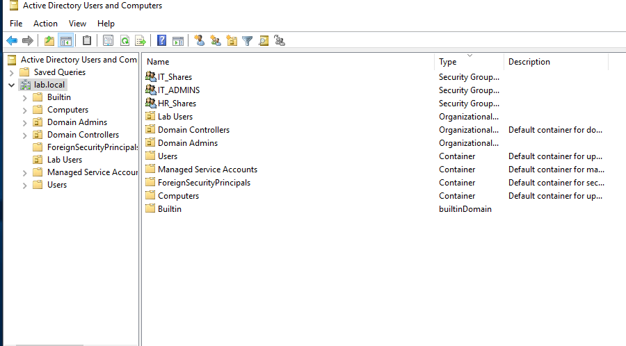
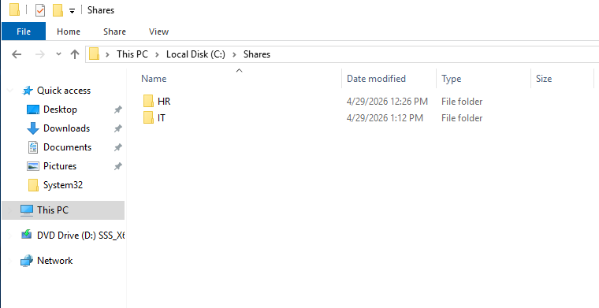
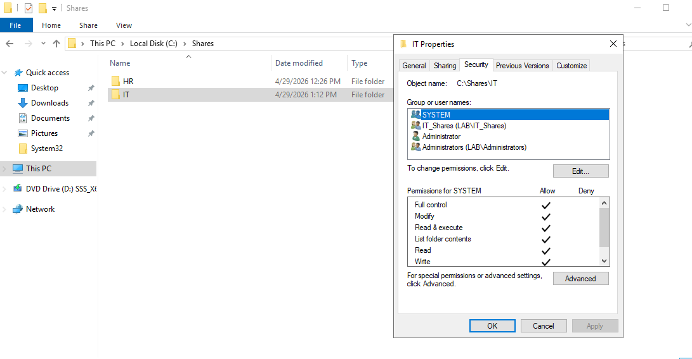
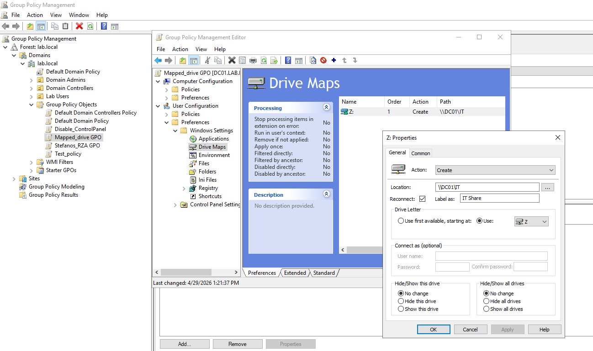
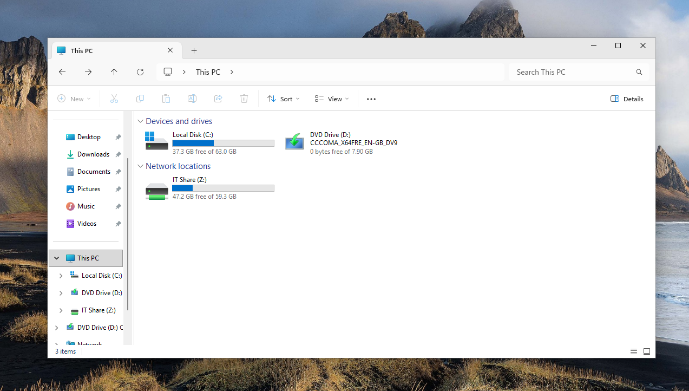
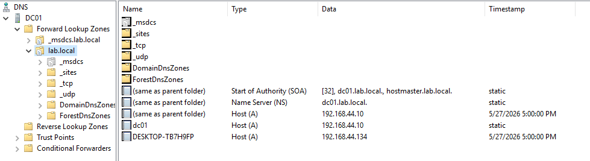
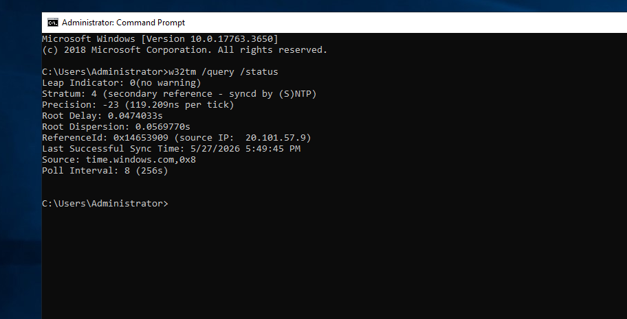
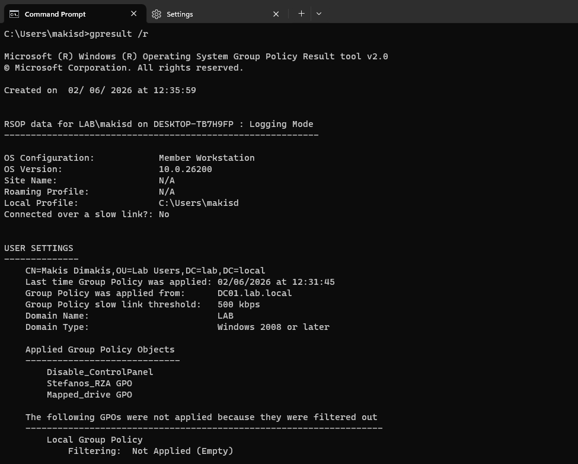
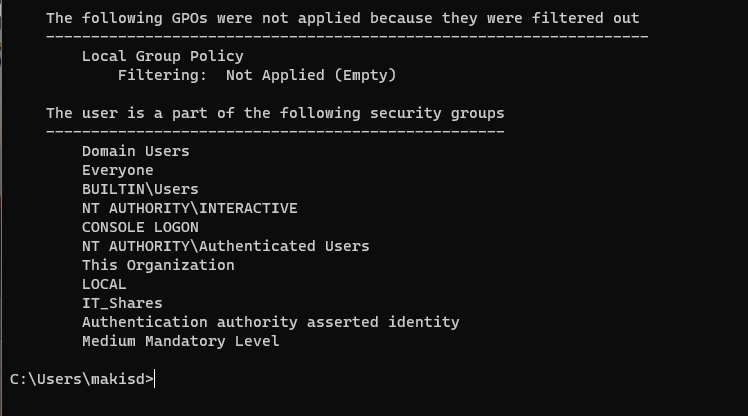

# Windows Server Active Directory Homelab

## Project Overview

This lab simulates a small Windows domain environment using VMware Workstation and Microsoft Windows Server services.

The goal was to build hands-on experience with Active Directory, DNS, NTP, file sharing, NTFS permissions, security groups, and Group Policy-based mapped drives.

## Lab Environment

| Component | Details |
|---|---|
| Hypervisor | VMware Workstation |
| Server OS | Windows Server 2019 Standard Evaluation |
| Domain | `lab.local` |
| Domain Controller | `DC01` |
| Domain Controller IP | `192.168.44.10` |
| Client | `DESKTOP-TB7H9FP` |
| Client IP | `192.168.44.134` |
| Test User | `LAB\makisd` |

## Implemented Services

- Active Directory Domain Services
- AD-integrated DNS
- External DNS forwarding
- NTP synchronization from the PDC Emulator
- SMB file shares
- NTFS permissions
- Share permissions
- AD security groups
- Group Policy Preferences drive mapping

## Active Directory Configuration

The domain `lab.local` was created on `DC01`. A basic OU and group structure was created for lab users and file access control.

### Objects Created

| Object | Type | Purpose |
|---|---|---|
| `Lab Users` | Organizational Unit | Stores lab user accounts |
| `IT_Shares` | Security Group | Grants access to the IT share |
| `HR_Shares` | Security Group | Grants access to the HR share |
| `IT_ADMINS` | Security Group | Administrative lab group |



## File Share Configuration

A basic file share structure was created under `C:\Shares`.

```text
C:\Shares
├── HR
└── IT
```



### Permission Model

Access was assigned using AD security groups instead of direct user permissions.

```text
Users -> Security Groups -> Permissions
```

| Folder | Security Group | Permission |
|---|---|---|
| `C:\Shares\IT` | `IT_Shares` | Modify |
| `C:\Shares\HR` | `HR_Shares` | Modify |



## Group Policy Drive Mapping

A Group Policy Object named `Mapped_drive GPO` was configured to map the IT share for users.

| Setting | Value |
|---|---|
| GPO | `Mapped_drive GPO` |
| Path | `\\DC01\IT` |
| Drive Letter | `Z:` |
| Label | `IT Share` |
| Action | `Create` |



The mapped drive was successfully applied on the domain-joined client.



## DNS Configuration

`DC01` was configured as the DNS server for the `lab.local` domain. The forward lookup zone contains records for the domain controller and the domain-joined client.

| Record | Type | Value |
|---|---|---|
| `dc01.lab.local` | A | `192.168.44.10` |
| `DESKTOP-TB7H9FP.lab.local` | A | `192.168.44.134` |



## NTP Configuration

The domain controller was configured to synchronize time from an external NTP source.

| Setting | Value |
|---|---|
| NTP Source | `time.windows.com,0x8` |
| Role | PDC Emulator / Domain Time Source |



## Validation

The lab was validated from both the server and client side.

| Validation | Evidence |
|---|---|
| DC joined to `lab.local` | `01-dc01-domain-info.png` |
| AD objects and security groups created | `02-active-directory-structure.png` |
| Share folders created | `03-shares-folder-structure.png` |
| NTFS permissions assigned to groups | `04-it-ntfs-permissions.png` |
| DNS records created | `05-dns-zone-records.png` |
| NTP synchronized successfully | `06-ntp-status.png` |
| GPO drive map configured | `07-gpo-drive-map-settings.png` |
| Mapped drive visible on client | `08-client-mapped-drive.png` |
| GPO applied to user | `09-gpresult-applied-gpo.png` |
| User is member of `IT_Shares` | `10-gpresult-user-groups.png` |





## Key Skills Practiced

- Installing and configuring Active Directory Domain Services
- Managing domain users, groups, and OUs
- Configuring AD-integrated DNS
- Configuring NTP on a domain controller
- Creating SMB shares
- Applying NTFS permissions using security groups
- Deploying mapped drives using Group Policy Preferences
- Validating GPO application with `gpresult`
- Testing access control using group membership

## Known Lab Limitation

In this initial lab, the domain controller also hosts the file shares. This was acceptable for learning purposes.
- Add a second domain controller `DC02`
- Add DHCP, backup, VLANs, and firewall integration
# windows-server-homelab
# windows-server-homelab
