# Lab 02 - Clean Domain Controller Baseline

## Project Overview

This lab documents a clean Windows Server Active Directory baseline environment built from a fresh installation.

The goal of this lab was to create a clean and structured domain foundation before adding more advanced services such as a dedicated file server, a second domain controller, advanced Group Policy, backup, VLANs, and firewall integration.

This lab focuses on:

- Windows Server Domain Controller deployment
- Active Directory Domain Services
- AD-integrated DNS
- DNS forwarding for external name resolution
- Basic OU structure design
- Domain users and security groups
- Admin account separation
- Domain client join
- Group Policy validation
- Domain Controller time synchronization with an external NTP source

---

## Lab Environment

| Component | Details |
|---|---|
| Hypervisor | VMware Workstation |
| Domain | `lab.local` |
| Domain Controller | `DC01` |
| Client | `CLIENT01` |
| Server OS | Windows Server 2022 Standard Evaluation, Desktop Experience |
| Client OS | Windows 11 Pro |
| Network | VMware NAT - `192.168.44.0/24` |

---

## Network Configuration

| Hostname | Role | IP Address | Gateway | DNS |
|---|---|---:|---:|---:|
| `DC01` | Domain Controller / DNS / NTP | `192.168.44.10` | `192.168.44.2` | `192.168.44.10` |
| `CLIENT01` | Domain-joined workstation | DHCP | `192.168.44.2` | `192.168.44.10` |

The domain controller uses itself as the preferred DNS server. External DNS resolution is handled through DNS forwarders configured on `DC01`.

---

## Active Directory Design

A clean OU structure was created under the root domain to avoid placing lab objects directly inside the default AD containers.

```text
lab.local
└── LAB
    ├── Users
    ├── Computers
    ├── Servers
    ├── Groups
    └── Admins
```

### Security Groups

| Group | Purpose |
|---|---|
| `SG_IT_Users` | IT department users |
| `SG_HR_Users` | HR department users |
| `SG_Finance_Users` | Finance department users |
| `SG_Lab_Admins` | Lab administrative accounts |

### Admin Account Model

A dedicated admin account was created and assigned through a security group:

```text
Lab Admin → SG_Lab_Admins → Domain Admins
```

This avoids relying only on the built-in `Administrator` account and demonstrates group-based administrative access.

---

## Implementation Summary

- Performed a clean Windows Server installation for `DC01`
- Assigned a static IP configuration to the domain controller
- Installed Active Directory Domain Services and DNS Server roles
- Promoted `DC01` as the first domain controller in a new forest: `lab.local`
- Verified FSMO roles are held by `DC01`
- Configured and validated DNS resolution for internal and external records
- Created a structured OU layout under `LAB`
- Created security groups for department and admin organization
- Created a dedicated admin account
- Joined `CLIENT01` to the `lab.local` domain
- Moved the client computer object to the correct OU
- Validated Group Policy application from `DC01.lab.local`
- Configured external NTP synchronization on the domain controller

---

## Validation Results

| Validation | Result |
|---|---|
| DC static IP configured | Successful |
| AD DS and DNS roles installed | Successful |
| Internal DNS lookup for `dc01.lab.local` | Successful |
| External DNS lookup for `google.com` | Successful |
| FSMO roles assigned to `DC01` | Successful |
| `CLIENT01` joined to `lab.local` | Successful |
| Domain login using `lab.admin` | Successful |
| Group Policy applied from `DC01.lab.local` | Successful |
| Domain Controller discovery using `nltest` | Successful |
| Client moved to `LAB/Computers` OU | Successful |
| NTP source configured as `time.windows.com,0x8` | Successful |

---

## Screenshots

| # | Screenshot | Description |
|---:|---|---|
| 01 | 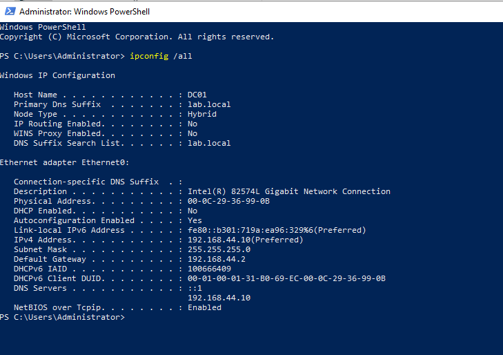 | DC01 static IP, gateway, and DNS configuration |
| 02 | 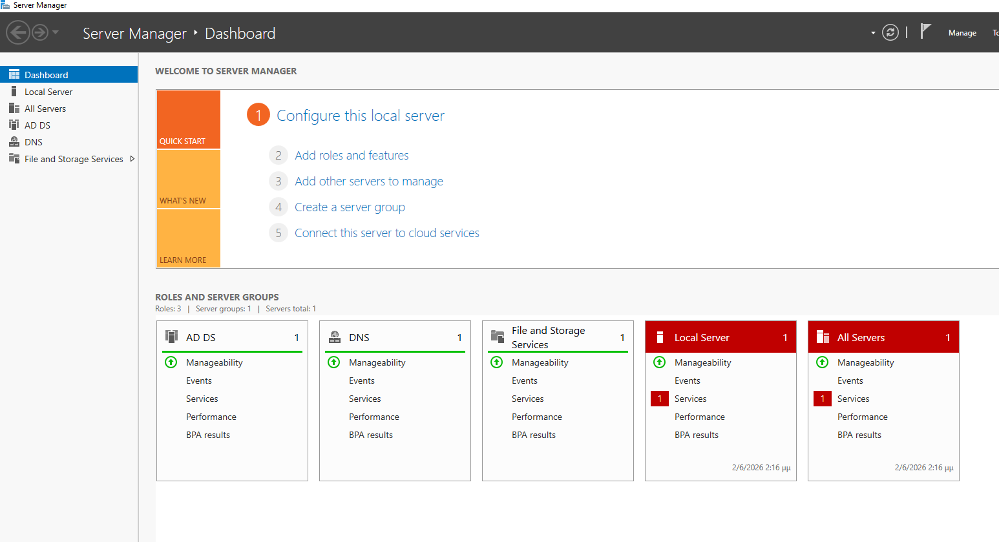 | AD DS and DNS roles visible in Server Manager |
| 03 | 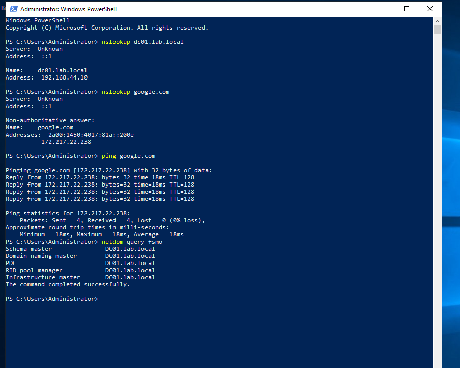 | Internal DNS, external DNS, ping, and FSMO validation |
| 04 | 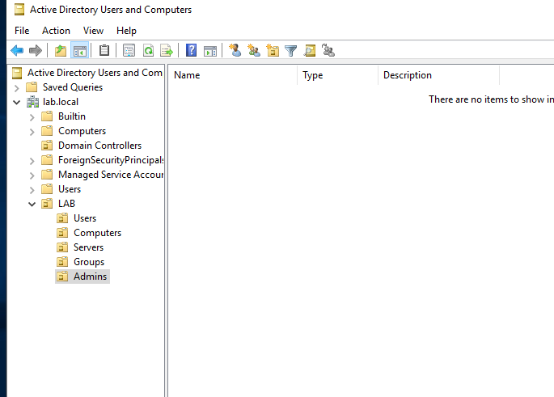 | LAB OU structure |
| 05 | 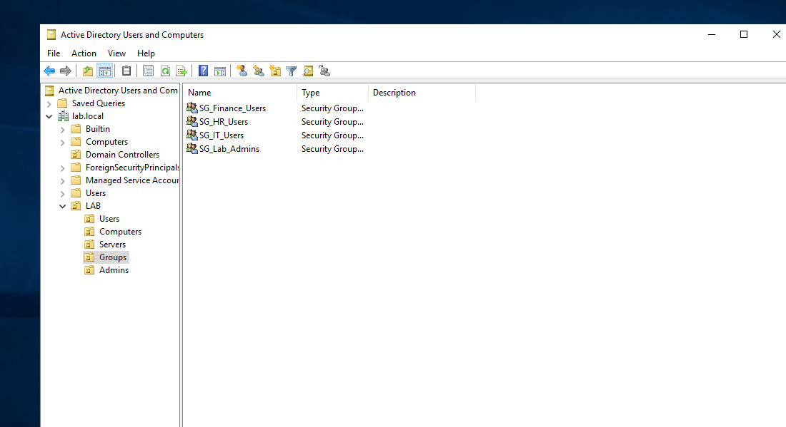 | AD security groups |
| 06 | 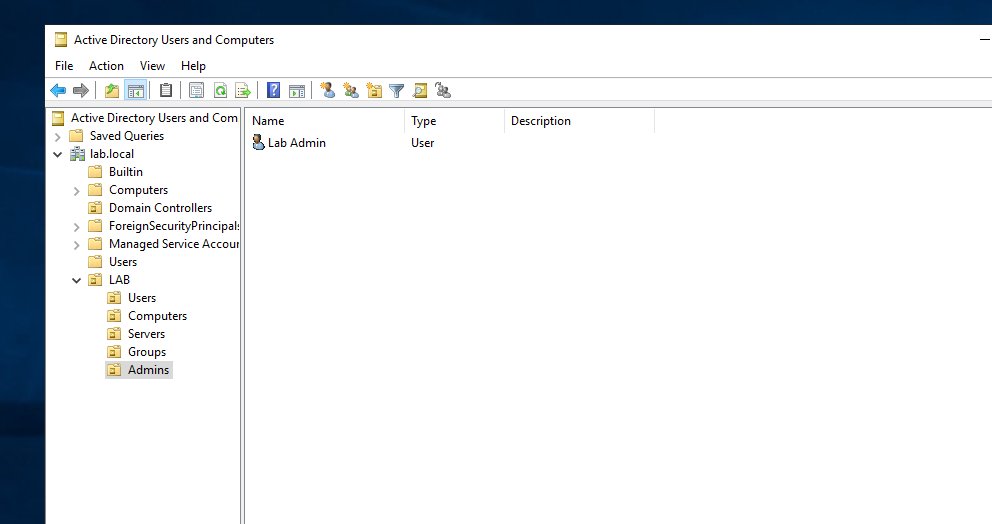 | Dedicated Lab Admin account |
| 07 | 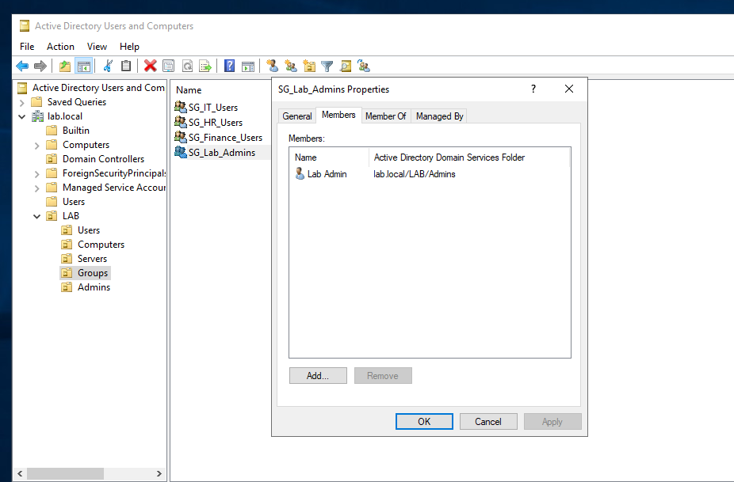 | Lab Admin inside SG_Lab_Admins |
| 08 | 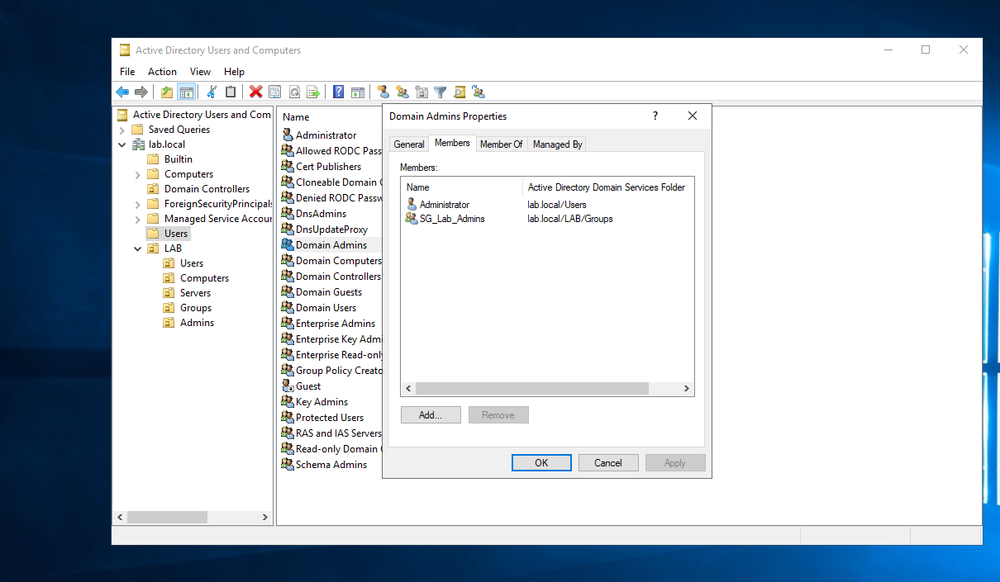 | SG_Lab_Admins inside Domain Admins |
| 09 | 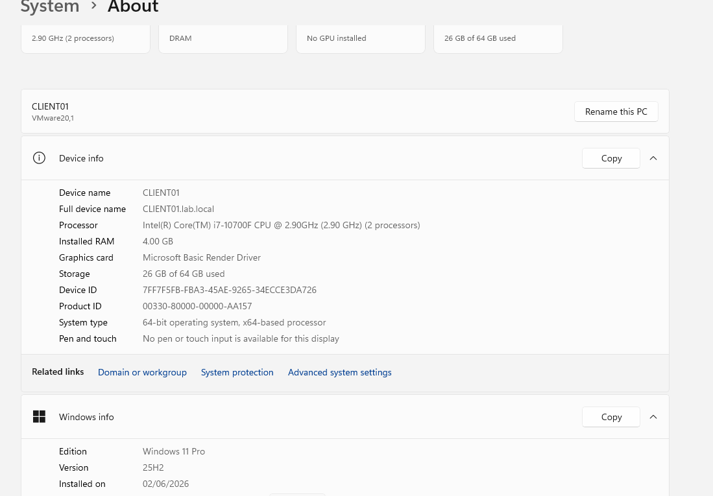 | CLIENT01 joined to lab.local |
| 10 | 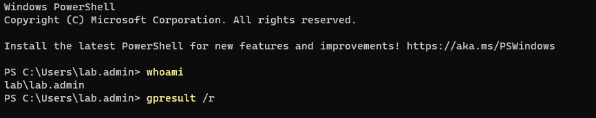 | Domain login validation with whoami |
| 11 | 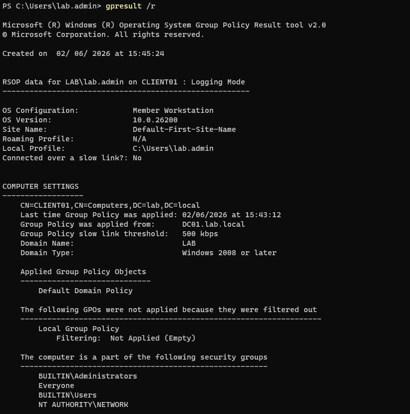 | Computer Group Policy validation |
| 12 | 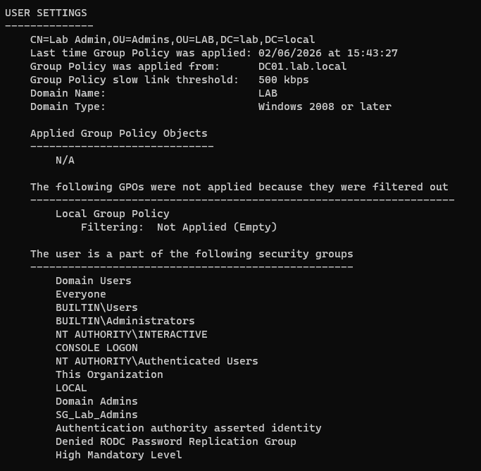 | User group membership validation |
| 13 | 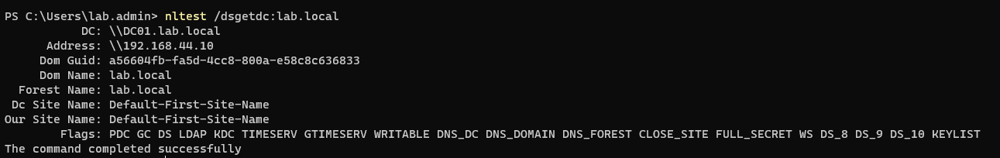 | Domain Controller discovery validation |
| 14 | 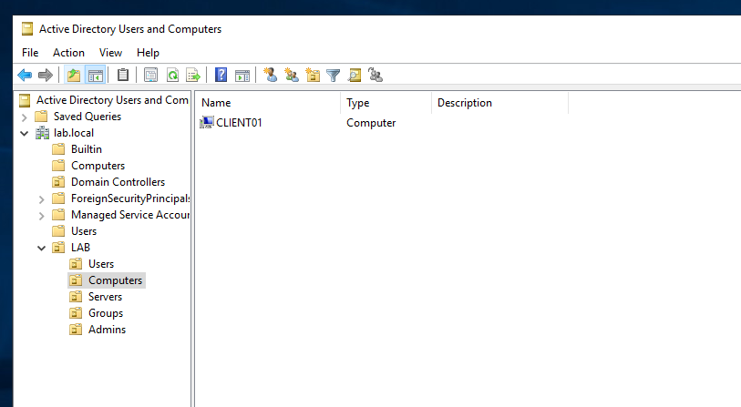 | CLIENT01 moved to LAB/Computers OU |
| 15 | 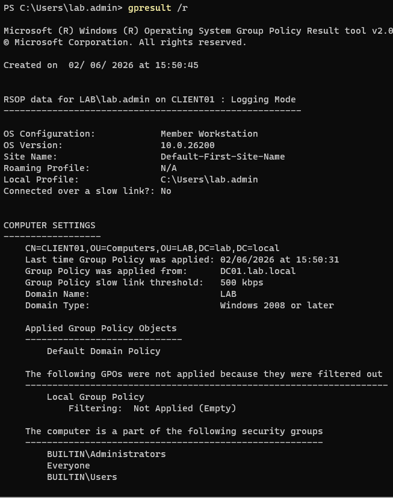 | gpresult confirms new computer OU path |
| 16 | 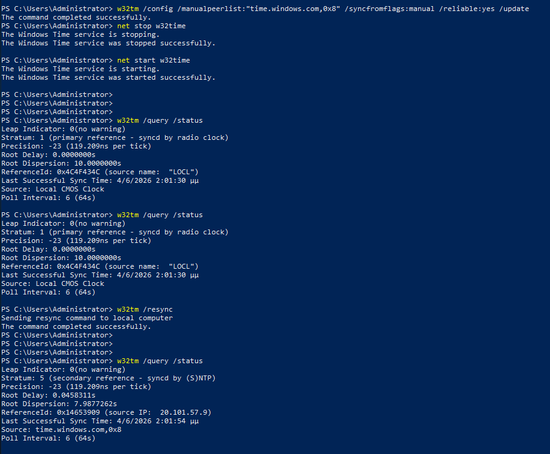 | DC01 synchronized with external NTP source |

---

## Known Lab Scope

This lab intentionally focuses only on the clean domain baseline.

The following items are planned for future labs:

- Dedicated file server `FS01`
- Department file shares
- NTFS and share permissions
- Advanced Group Policy configuration
- Second domain controller `DC02`
- AD replication validation
- Backup and restore testing
- VLANs and firewall integration

---

## Key Skills Practiced

- Clean Windows Server deployment
- Static IP and DNS planning for Active Directory
- Domain Controller promotion
- AD-integrated DNS validation
- OU and group structure design
- Group-based administrative access
- Windows domain join process
- Group Policy result validation
- Domain Controller discovery troubleshooting
- Windows Time service configuration
