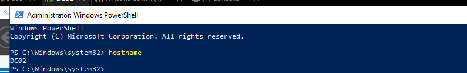
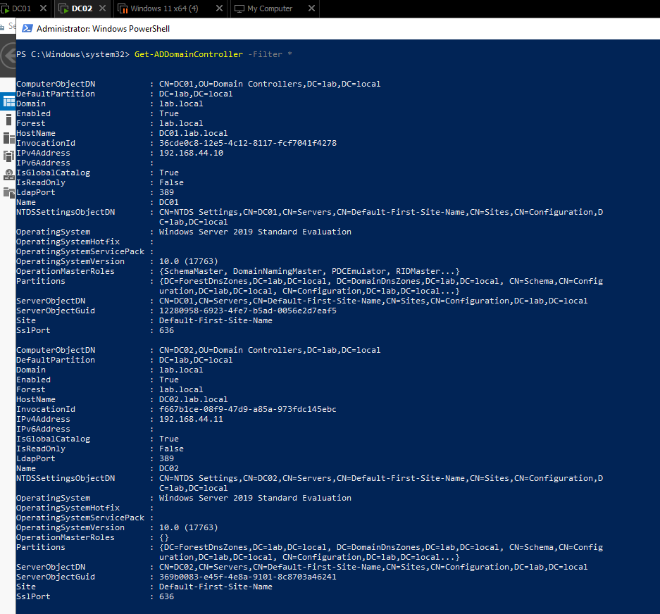
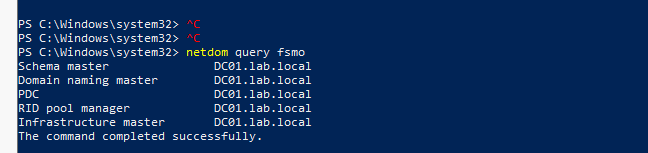
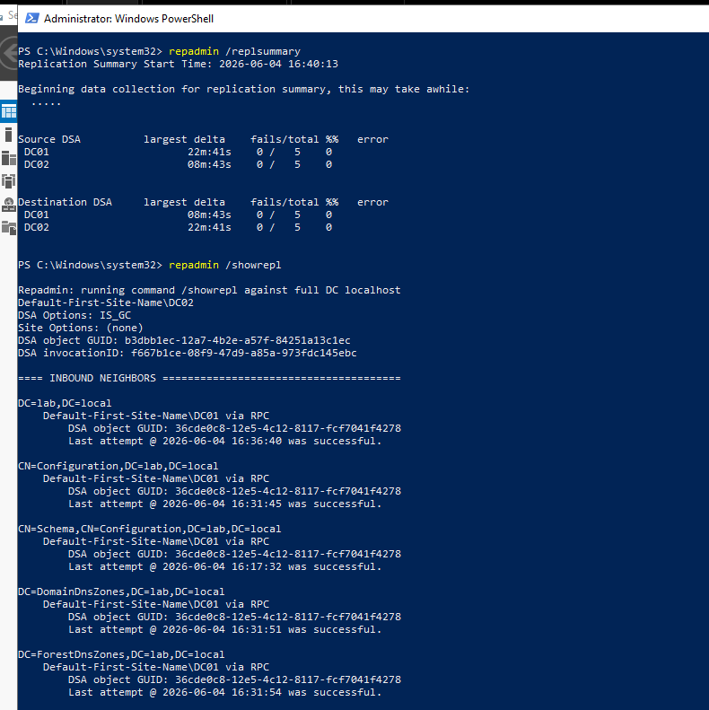
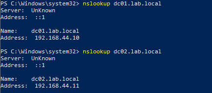
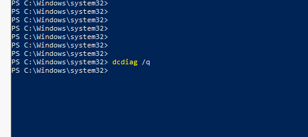
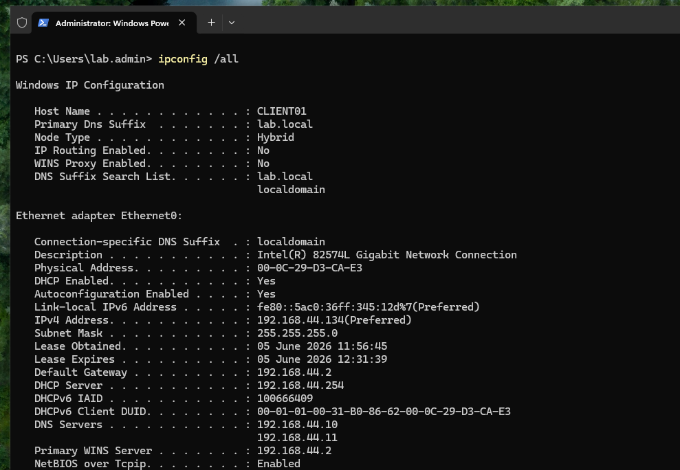
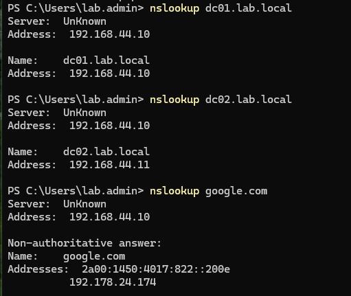
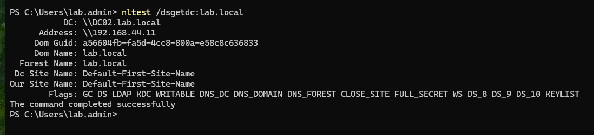
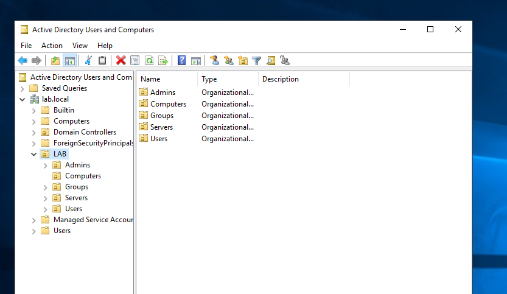

# Lab 03 - Second Domain Controller and AD Replication

## Project Overview

This lab extends the existing `lab.local` Active Directory environment by adding a second Domain Controller, `DC02`.

The goal of this lab was to improve the domain design by introducing redundancy for Active Directory and DNS services. The lab also validates replication between domain controllers and confirms that a domain-joined client can discover and use the second Domain Controller.

This lab focuses on:

- Adding a second Domain Controller to an existing domain
- Installing Active Directory Domain Services on `DC02`
- Promoting `DC02` as an additional Domain Controller
- Installing DNS on `DC02`
- Validating AD replication between `DC01` and `DC02`
- Confirming FSMO roles remain on `DC01`
- Configuring client DNS redundancy
- Validating Domain Controller discovery from `CLIENT01`

---

## Lab Environment

| Component | Details |
|---|---|
| Hypervisor | VMware Workstation |
| Domain | `lab.local` |
| Primary Domain Controller | `DC01` |
| Additional Domain Controller | `DC02` |
| Client | `CLIENT01` |
| DC02 OS | Windows Server 2019 Standard Evaluation, Desktop Experience |
| Client OS | Windows 11 Pro |
| Network | VMware NAT - `192.168.44.0/24` |

---

## Network Configuration

| Hostname | Role | IP Address | Gateway | DNS Configuration |
|---|---|---:|---:|---|
| `DC01` | Domain Controller / DNS / FSMO holder | `192.168.44.10` | `192.168.44.2` | `192.168.44.10`, `192.168.44.11` |
| `DC02` | Additional Domain Controller / DNS | `192.168.44.11` | `192.168.44.2` | `192.168.44.11`, `192.168.44.10` |
| `CLIENT01` | Domain-joined workstation | DHCP | `192.168.44.2` | `192.168.44.10`, `192.168.44.11` |

`CLIENT01` was configured with both Domain Controllers as DNS servers. This allows the client to resolve Active Directory records through either `DC01` or `DC02`.

---

## Final Architecture

```text
lab.local
├── DC01
│   ├── Domain Controller
│   ├── DNS Server
│   └── FSMO Role Holder
│
├── DC02
│   ├── Additional Domain Controller
│   ├── DNS Server
│   └── Global Catalog
│
└── CLIENT01
    └── Domain-joined Windows client
```

---

## Why Add a Second Domain Controller?

A single Domain Controller is a single point of failure for authentication, DNS, Group Policy, and domain service discovery.

Adding `DC02` provides:

- Redundancy for Active Directory authentication
- Redundancy for DNS resolution
- A second Global Catalog server
- Replication practice and troubleshooting experience
- A more realistic enterprise-style domain design

In this lab, `DC01` remains the FSMO role holder, while `DC02` acts as an additional writable Domain Controller.

---

## Implementation Summary

- Installed Windows Server on `DC02`
- Renamed the server to `DC02`
- Assigned a static IP address: `192.168.44.11`
- Configured initial DNS on `DC02` to point to `DC01`
- Joined `DC02` to the existing `lab.local` domain as a member server
- Installed Active Directory Domain Services and DNS Server roles
- Promoted `DC02` as an additional Domain Controller in the existing domain
- Enabled DNS Server and Global Catalog options during promotion
- Replicated AD data from `DC01`
- Validated that both Domain Controllers are visible in AD
- Verified FSMO roles remain on `DC01`
- Verified AD replication using `repadmin`
- Verified DNS records for both Domain Controllers
- Configured `CLIENT01` to use both `DC01` and `DC02` as DNS servers
- Confirmed `CLIENT01` can discover `DC02` as a Domain Controller

---

## Validation Results

| Validation | Result |
|---|---|
| `DC02` hostname configured correctly | Successful |
| `DC02` promoted as additional Domain Controller | Successful |
| Both `DC01` and `DC02` listed as Domain Controllers | Successful |
| FSMO roles remain on `DC01` | Successful |
| AD replication summary shows 0 failures | Successful |
| `repadmin /showrepl` shows successful inbound replication | Successful |
| DNS resolves `dc01.lab.local` | Successful |
| DNS resolves `dc02.lab.local` | Successful |
| `dcdiag /q` shows no current errors after clearing old System Log events | Successful |
| `CLIENT01` configured with dual DNS servers | Successful |
| `CLIENT01` resolves internal and external DNS records | Successful |
| `CLIENT01` discovers `DC02` using `nltest` | Successful |
| AD OU structure replicated to `DC02` | Successful |

---

## Screenshots

| # | Screenshot | Description |
|---:|---|---|
| 01 |  | Hostname validation showing `DC02` |
| 02 |  | `Get-ADDomainController -Filter *` showing `DC01` and `DC02` |
| 03 |  | FSMO roles remain assigned to `DC01.lab.local` |
| 04 |  | `repadmin /replsummary` and `repadmin /showrepl` validation |
| 05 |  | DNS resolution for both Domain Controllers |
| 06 |  | `dcdiag /q` returning no current errors |
| 07 |  | `CLIENT01` configured with both DCs as DNS servers |
| 08 |  | Client resolves `dc01`, `dc02`, and external DNS records |
| 09 |  | `CLIENT01` discovers `DC02` as a Domain Controller |
| 10 |  | OU structure visible from `DC02`, confirming replication |

---

## Key Concepts Learned

### Additional Domain Controller

`DC02` was added to the existing `lab.local` domain as an additional writable Domain Controller. This improves resilience compared to having a single Domain Controller.

### AD Replication

Active Directory data such as users, groups, OUs, and DNS zones is replicated between Domain Controllers. This was validated using `repadmin` and by confirming that the `LAB` OU structure was visible from `DC02`.

### FSMO Roles

Even though there are now two Domain Controllers, FSMO roles still belong to one Domain Controller. In this lab, all FSMO roles remain on `DC01`.

### DNS Redundancy

Both `DC01` and `DC02` run DNS. `CLIENT01` is configured with both DNS servers so it can continue resolving domain records even if one DNS server is unavailable.

### Domain Controller Discovery

The client uses DNS records to discover available Domain Controllers. This was validated with:

```cmd
nltest /dsgetdc:lab.local
```

The command successfully returned `DC02.lab.local`, proving the client can discover the additional Domain Controller.

---

## Known Lab Notes

- `DC01` remains the FSMO role holder.
- `DC02` is configured as a writable Domain Controller, not an RODC.
- `dcdiag /q` initially reported old System Log events related to a previous domain join attempt and temporary RID allocation warning. After validating RID Manager and clearing old System Log events, `dcdiag /q` returned no current errors.
- DNS reverse lookup was not configured in this lab, so some `nslookup` outputs may show `Server: Unknown`. Forward DNS resolution worked correctly.

---

## Next Planned Labs

Potential next labs include:

- Dedicated file server `FS01`
- Department shares and NTFS permissions
- Advanced Group Policy configuration
- Backup and restore testing
- DHCP services
- VLAN segmentation and firewall integration
