# Lab 04 - Dedicated File Server with NTFS, SMB Shares, and GPO Mapped Drives

## Project Overview

This lab builds a dedicated Windows Server file server for the `lab.local` Active Directory environment.

The goal is to move file sharing away from Domain Controllers and implement a cleaner enterprise-style design using:

- Dedicated File Server role on `FS01`
- Separate data disk for shared folders
- SMB shares
- NTFS permissions
- AD security groups
- Group nesting
- Group Policy Preferences drive mapping
- Client-side access validation

This lab builds on the previous domain baseline and second Domain Controller labs.

---

## Environment

| Hostname | Role | IP Address |
|---|---|---|
| DC01 | Domain Controller / DNS / FSMO / NTP | 192.168.44.10 |
| DC02 | Additional Domain Controller / DNS | 192.168.44.11 |
| FS01 | Dedicated File Server | 192.168.44.20 |
| CLIENT01 | Domain-joined Windows client | DHCP |

Domain:

```text
lab.local
```

---

## Design Goal

The file server was separated from the Domain Controllers.

Previous learning lab design:

```text
DC01 = Domain Controller + DNS + File Shares
```

Improved design:

```text
DC01 = Identity / DNS / FSMO / NTP
DC02 = Identity / DNS redundancy
FS01 = File services
CLIENT01 = Validation client
```

This design keeps Domain Controllers focused on authentication, DNS, and directory services, while file services are hosted on a dedicated server.

---

## Storage Design

A second virtual disk was added to `FS01` and formatted as `D:` with the label `DATA`.

```text
C: = Operating System
D: = Data / File Shares
```

Folder structure:

```text
D:\Shares
├── IT
├── HR
├── Finance
└── Public
```

---

## Active Directory Group Design

Department groups identify user roles:

```text
SG_IT_Users
SG_HR_Users
SG_Finance_Users
```

File server permission groups identify access to resources:

```text
DL_FS_IT_Modify
DL_FS_HR_Modify
DL_FS_Finance_Modify
DL_FS_Public_Modify
```

Group nesting model:

```text
User → Department Group → File Server Permission Group → NTFS Permission
```

Example:

```text
john.it → SG_IT_Users → DL_FS_IT_Modify → Modify on D:\Shares\IT
```

This avoids assigning permissions directly to individual users.

---

## NTFS Permission Model

NTFS permissions were applied directly to each department folder.

Example for IT:

| Principal | Permission |
|---|---|
| SYSTEM | Full Control |
| Administrators | Full Control |
| DL_FS_IT_Modify | Modify |

The same pattern was applied to HR, Finance, and Public folders using their matching permission groups.

---

## SMB Shares

The following SMB shares were created on `FS01`:

| Share | Local Path |
|---|---|
| `\\FS01\IT` | `D:\Shares\IT` |
| `\\FS01\HR` | `D:\Shares\HR` |
| `\\FS01\Finance` | `D:\Shares\Finance` |
| `\\FS01\Public` | `D:\Shares\Public` |

Share permissions were left open enough for network access, while NTFS permissions controlled the real security boundary.

Key rule:

```text
Effective access = most restrictive result between Share Permissions and NTFS Permissions
```

---

## Group Policy Drive Mapping

A Group Policy Object was created:

```text
GPO_Mapped_Drives_FS01
```

Drive mappings:

| Group | Drive | Path |
|---|---|---|
| SG_IT_Users | I: | `\\FS01\IT` |
| SG_HR_Users | H: | `\\FS01\HR` |
| SG_Finance_Users | F: | `\\FS01\Finance` |
| Domain Users | P: | `\\FS01\Public` |

Item-level targeting was used so users only receive the mapped drives relevant to their group membership.

Example:

```text
If user is a member of LAB\SG_IT_Users → map I: to \\FS01\IT
```

---

## Validation

### FS01 domain integration

Validated that `FS01` is joined to the domain and can discover a Domain Controller.

Commands used:

```cmd
whoami
hostname
nltest /dsgetdc:lab.local
gpresult /r
```

### SMB and NTFS access validation

Validated using an IT user:

| Test | Result |
|---|---|
| Access `\\FS01\IT` | Successful |
| Create test file in `\\FS01\IT` | Successful |
| Access `\\FS01\HR` | Denied |

This confirms that permissions are group-based and department-specific.

### GPO mapped drive validation

Validated with user `john.it`.

`gpresult /r` confirmed that `GPO_Mapped_Drives_FS01` applied successfully.

Expected mapped drives for IT user:

```text
IT Share (I:)
Public (P:)
```

The IT user did not receive HR or Finance mapped drives.

---

## Key Skills Practiced

- Windows Server file server configuration
- Dedicated server role separation
- Additional virtual disk and data volume design
- SMB share creation
- NTFS permission management
- AD security group design
- Group nesting for access control
- Group Policy Preferences drive mapping
- Item-level targeting
- Client-side validation and troubleshooting

---

## Screenshots

### FS01 static IP configuration
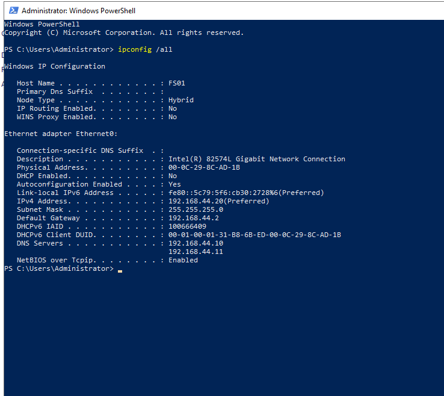

### FS01 domain controller discovery
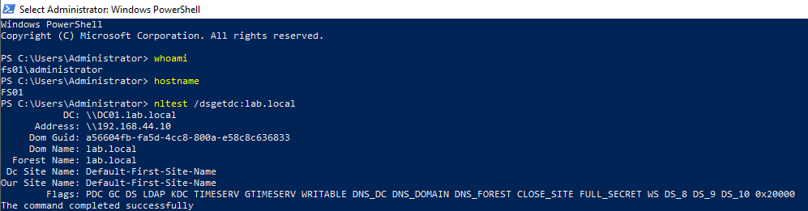

### FS01 Group Policy result after domain join
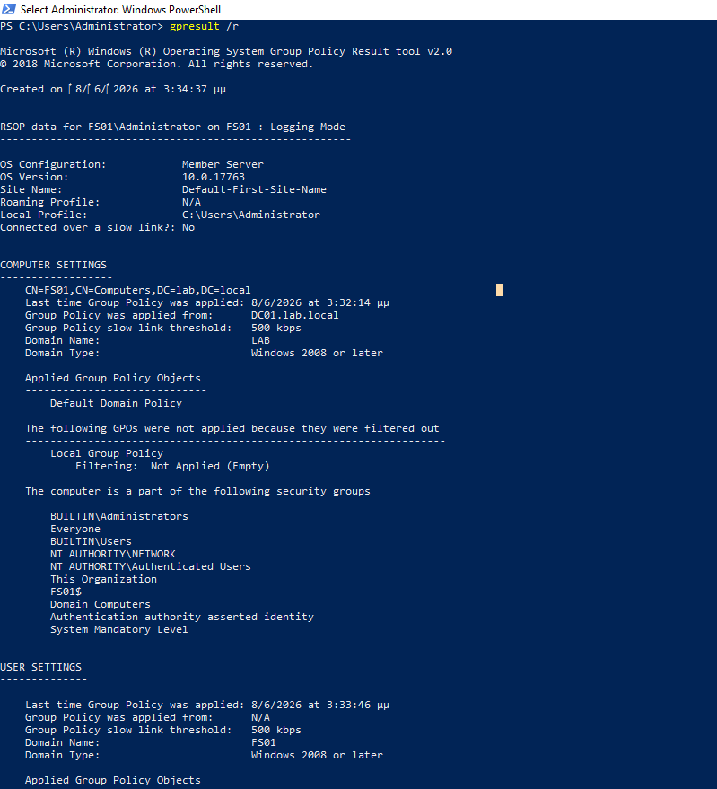

### FS01 moved to Servers OU
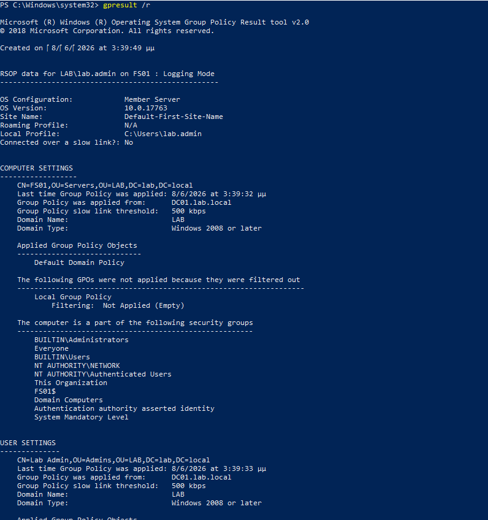

### File Server role installed
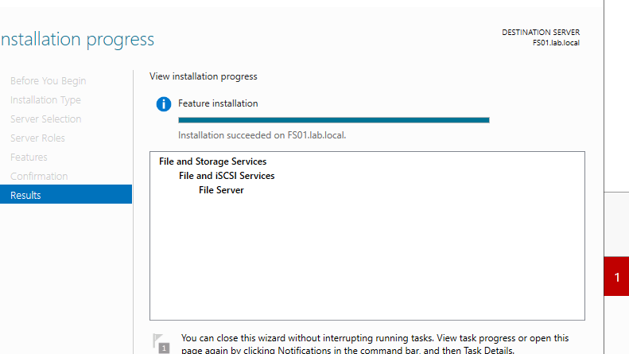

### Share folder structure on data disk
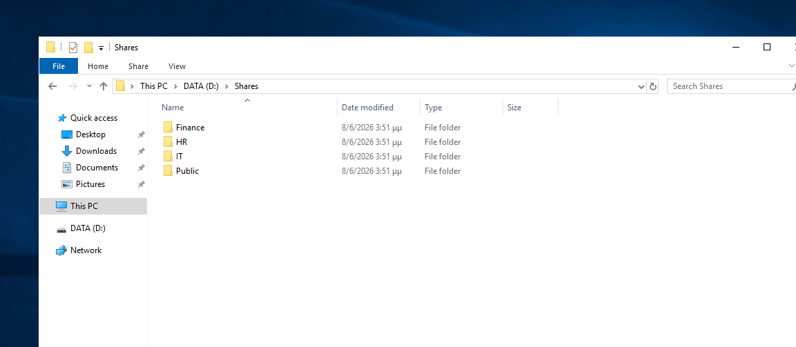

### AD permission groups
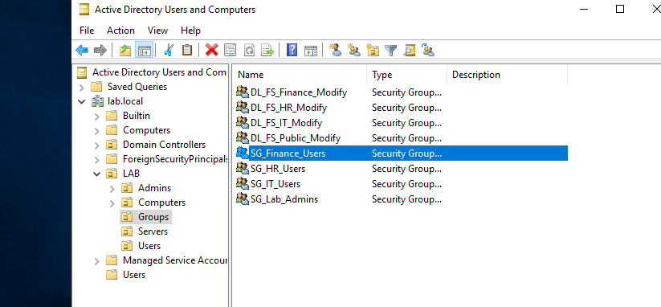

### Group nesting example
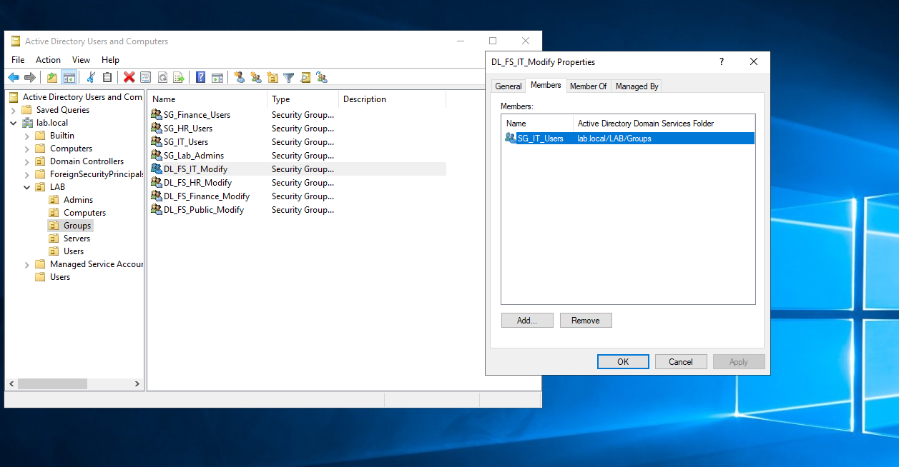

### NTFS permissions on IT folder
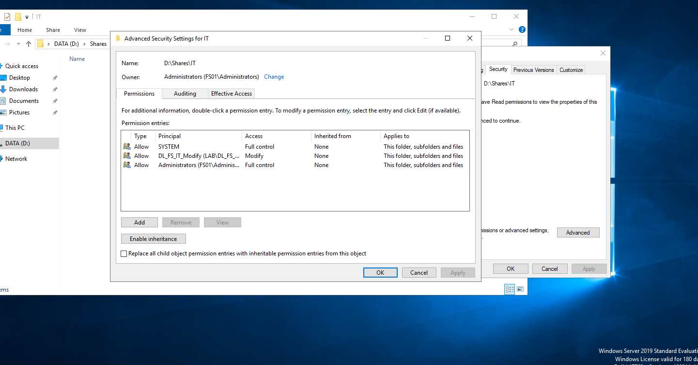

### SMB share permissions wizard
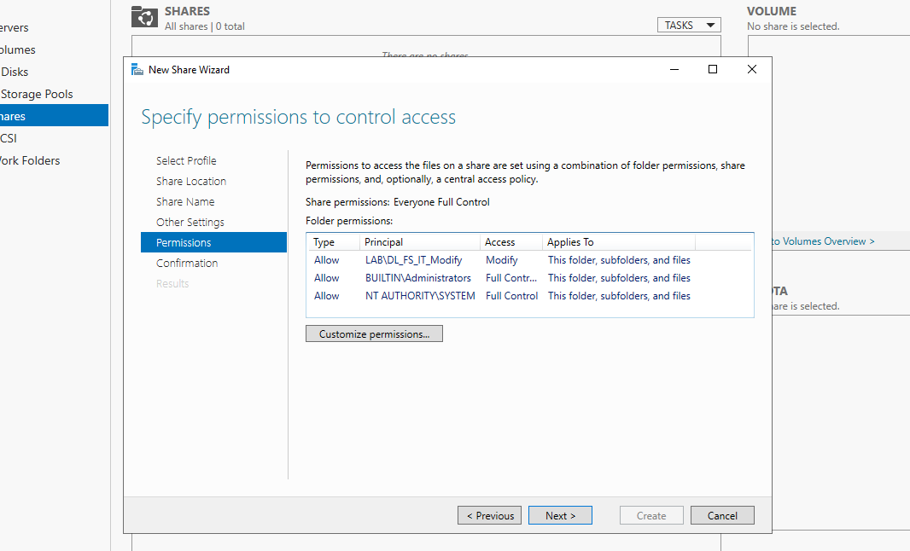

### SMB shares created on FS01
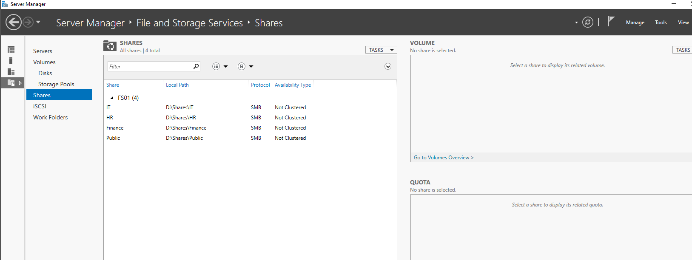

### IT user access to IT share
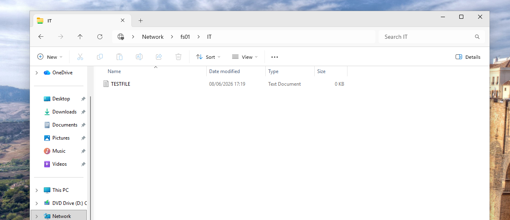

### IT user denied access to HR share
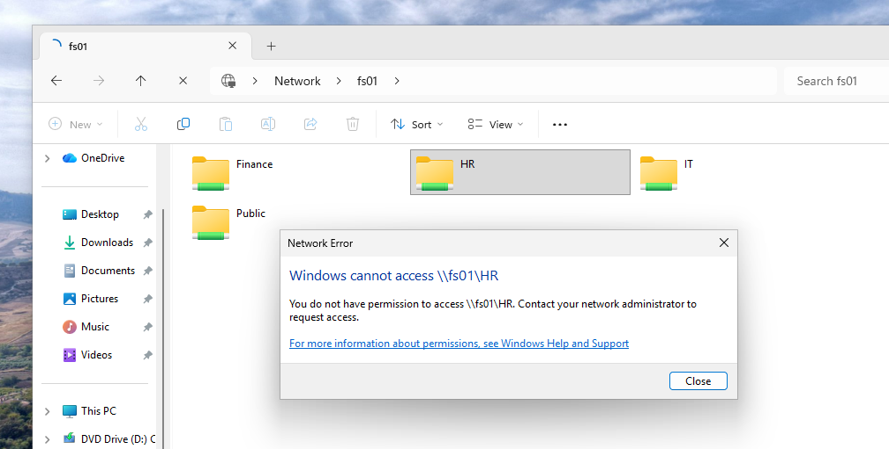

### GPO drive map configuration
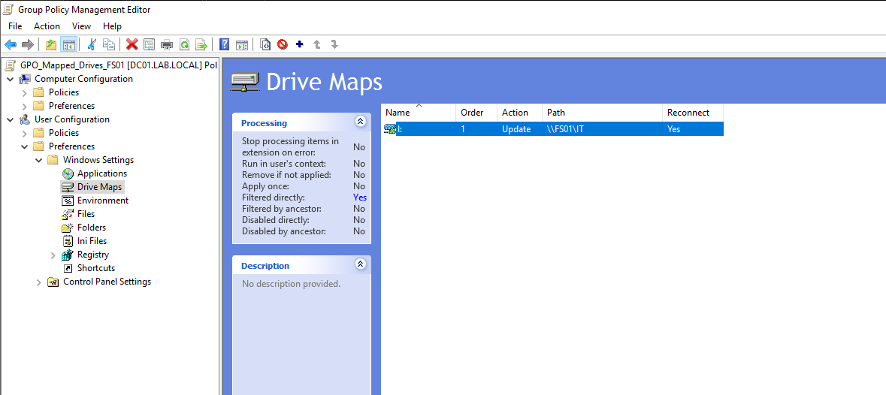

### GPO item-level targeting
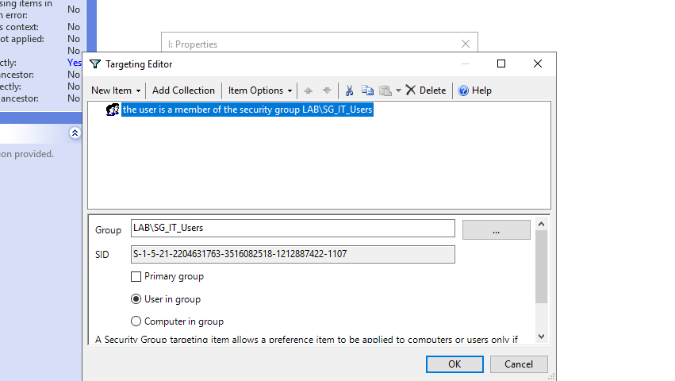

### GPO applied to IT user
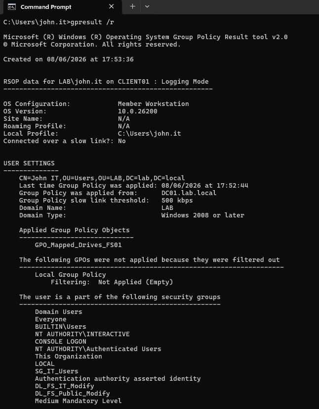

### IT user mapped drives
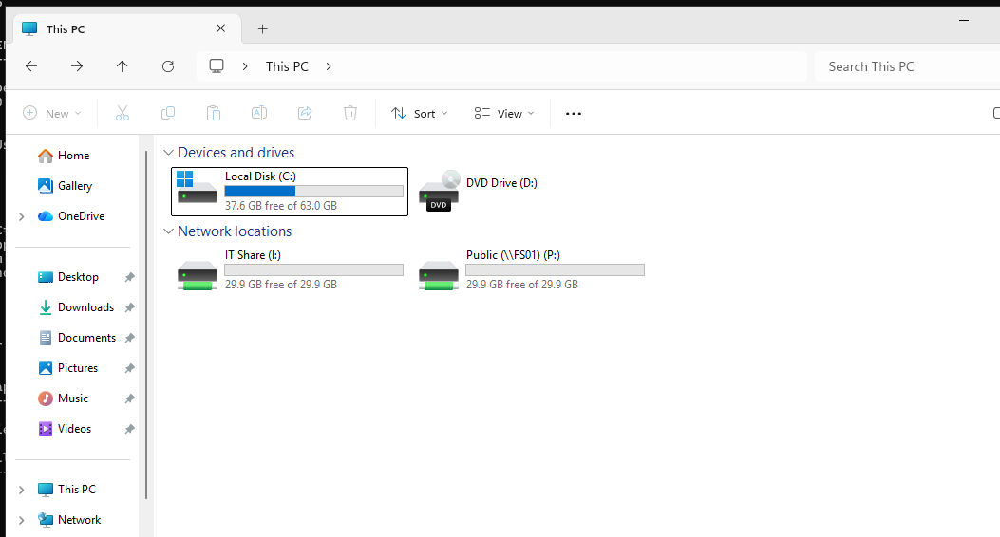

---

## Known Notes

This lab intentionally focuses on core file server design and mapped drive deployment.

Future improvements may include:

- File Server Resource Manager
- Quotas
- File screening
- Access-Based Enumeration validation
- Backup and restore testing
- DFS Namespace
- DFS Replication
