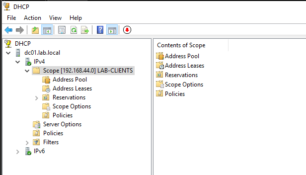
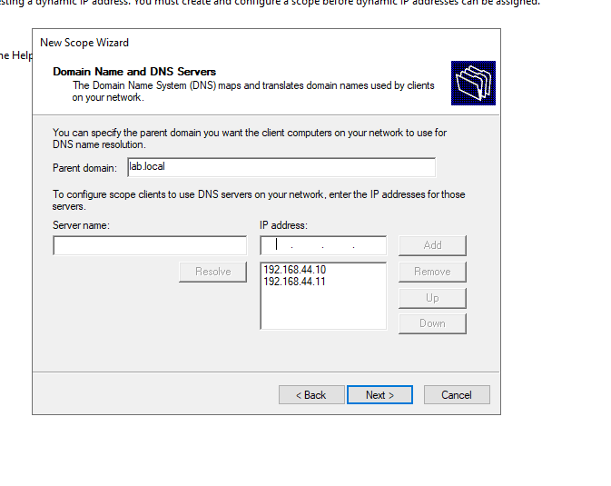
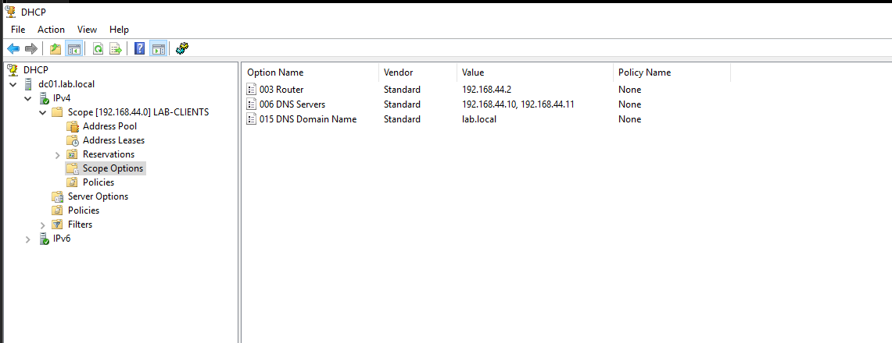
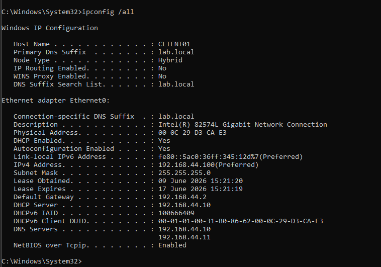
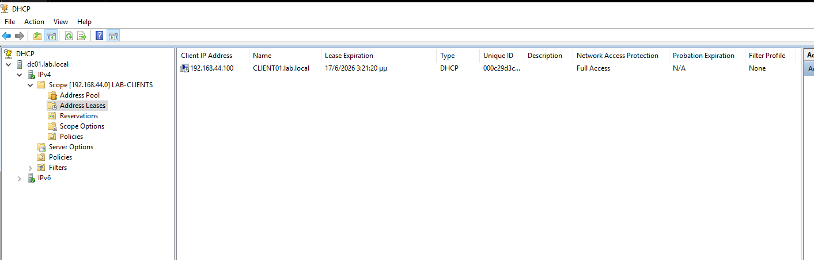
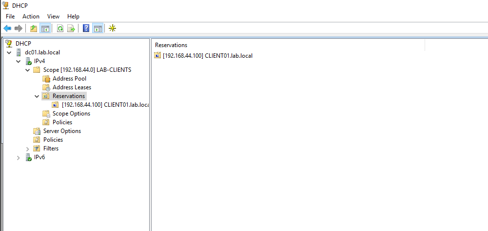
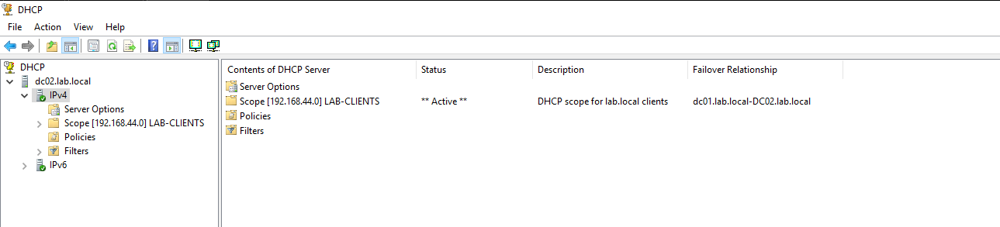
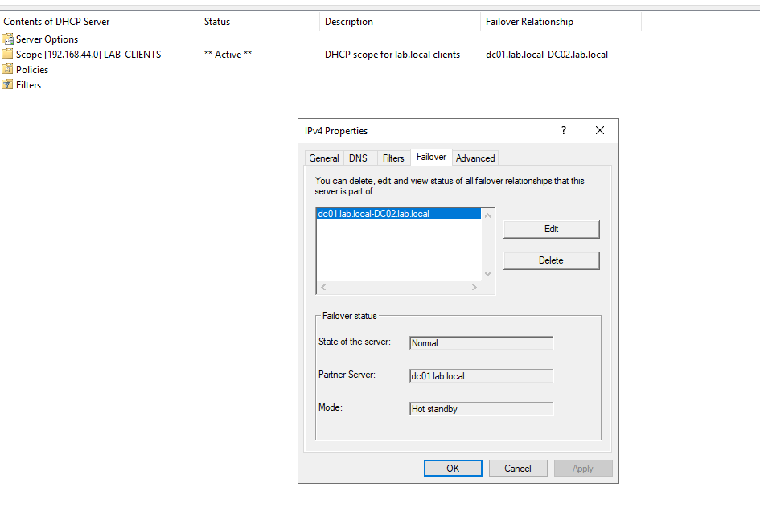
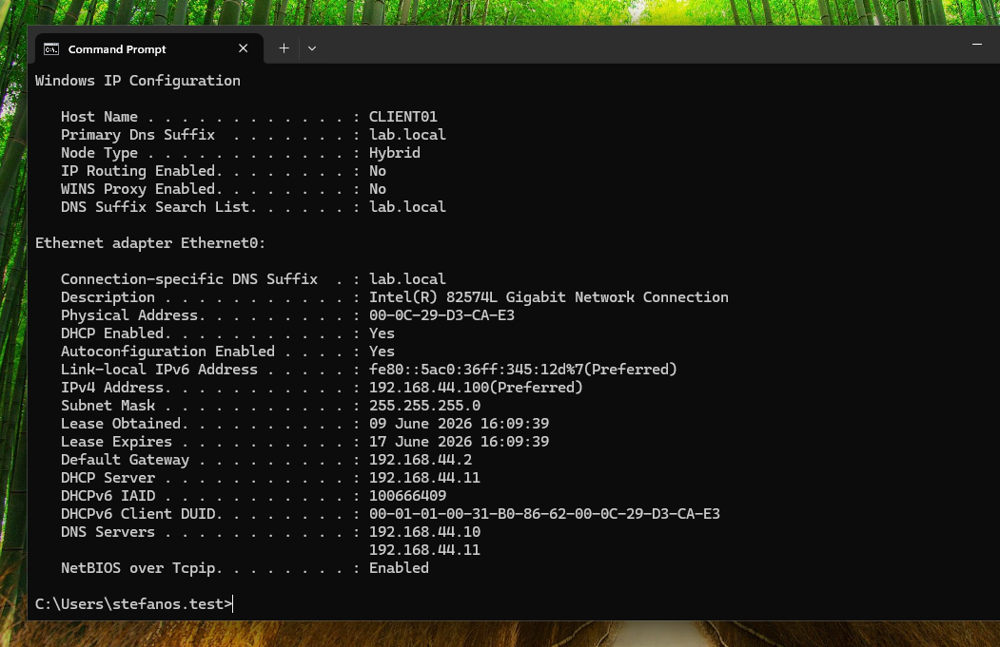

# Lab 05 - Windows DHCP Server, Scope, Reservation and Failover

## Overview

In this lab, I replaced the VMware NAT DHCP service with a Windows Server DHCP service running inside the domain environment. The initial DHCP scope was created on `DC01`, validated from `CLIENT01`, and then configured for DHCP failover with `DC02` using Hot Standby mode.

This lab builds on the previous Active Directory, DNS, replication, and file server labs.

## Lab Environment

| Hostname | Role | IP Address |
|---|---|---|
| `DC01` | Domain Controller, DNS, DHCP primary, FSMO holder | `192.168.44.10` |
| `DC02` | Domain Controller, DNS, DHCP failover partner | `192.168.44.11` |
| `FS01` | Dedicated File Server | `192.168.44.20` |
| `CLIENT01` | Domain-joined Windows client | DHCP lease |

## DHCP Design

The VMware DHCP service on `VMnet8` was disabled so that DHCP would be controlled by Windows Server instead of VMware.

The DHCP scope was configured as:

| Setting | Value |
|---|---|
| Scope Name | `LAB-CLIENTS` |
| Network | `192.168.44.0/24` |
| DHCP Range | `192.168.44.100 - 192.168.44.200` |
| Subnet Mask | `255.255.255.0` |
| Default Gateway | `192.168.44.2` |
| DNS Servers | `192.168.44.10`, `192.168.44.11` |
| DNS Domain | `lab.local` |

The goal was to make the domain environment responsible for client network configuration while keeping VMware NAT only for internet access.

---

## 1. DHCP Scope Created on DC01

A new IPv4 DHCP scope named `LAB-CLIENTS` was created on `DC01`. This scope defines the IP range that domain clients can receive dynamically.

---

## 2. DNS Options Configured During Scope Creation

The DHCP scope was configured to provide the Active Directory DNS servers to clients. This is important because domain clients must use domain DNS servers to locate Domain Controllers and domain services.

---

## 3. Scope Options Verified

The scope options were verified after creation. These options define the network configuration that DHCP clients will receive.

Configured options:

- `003 Router`: `192.168.44.2`
- `006 DNS Servers`: `192.168.44.10`, `192.168.44.11`
- `015 DNS Domain Name`: `lab.local`

---

## 4. CLIENT01 Received DHCP Lease from DC01

After renewing the client network configuration, `CLIENT01` received an IP address from the Windows DHCP Server instead of VMware DHCP.

Validated values:

- DHCP Server: `192.168.44.10`
- IPv4 Address: `192.168.44.100`
- Gateway: `192.168.44.2`
- DNS Servers: `192.168.44.10`, `192.168.44.11`
- DNS suffix: `lab.local`

---

## 5. DHCP Lease Verified on DC01

The DHCP lease was also verified from the DHCP server console. This confirms that `DC01` assigned and recorded the lease for `CLIENT01.lab.local`.

---

## 6. DHCP Reservation Created for CLIENT01

A reservation was created for `CLIENT01`, binding the client to `192.168.44.100` based on its client identifier / MAC address.

This allows the client to stay as a DHCP client while consistently receiving the same IP address.

---

## 7. DHCP Failover Scope Present on DC02

DHCP was installed on `DC02`, and a DHCP failover relationship was configured from the existing scope on `DC01`.

The scope appeared on `DC02`, confirming that the failover relationship was created successfully.

---

## 8. DHCP Failover Relationship Verified

The DHCP failover relationship was configured in **Hot Standby** mode.

In this design:

- `DC01` is the active DHCP server during normal operation.
- `DC02` acts as the standby DHCP server.
- If DHCP on `DC01` becomes unavailable, `DC02` can respond to client DHCP requests.

The failover state was verified as `Normal`.

---

## 9. DHCP Failover Test

To validate failover, the DHCP Server service on `DC01` was stopped temporarily. Then `CLIENT01` renewed its DHCP lease.

`CLIENT01` successfully received DHCP service from `DC02`:

- DHCP Server: `192.168.44.11`
- IPv4 Address: `192.168.44.100`
- DNS Servers: `192.168.44.10`, `192.168.44.11`

This confirms that DHCP Hot Standby failover works correctly.

---

## Validation Summary

| Check | Result |
|---|---|
| VMware DHCP disabled | Completed |
| DHCP role installed on DC01 | Completed |
| DHCP scope created | Completed |
| Scope options configured | Completed |
| CLIENT01 received lease from DC01 | Passed |
| Lease visible in DHCP console | Passed |
| DHCP reservation created | Completed |
| DHCP role installed on DC02 | Completed |
| DHCP failover relationship created | Completed |
| Failover mode configured as Hot Standby | Completed |
| CLIENT01 received lease from DC02 during failover test | Passed |

## Key Skills Practiced

- Installing and authorizing a Windows DHCP Server in Active Directory
- Creating DHCP scopes
- Configuring DHCP options
- Understanding DHCP leases and reservations
- Disabling competing DHCP services in a lab subnet
- Configuring DHCP failover
- Testing Hot Standby failover behavior
- Validating DHCP client configuration with `ipconfig`

## Notes

This lab used `DC01` and `DC02` as DHCP servers for learning purposes. In larger production environments, DHCP may run on dedicated infrastructure servers instead of Domain Controllers depending on the design and operational requirements.
