# Lab 06 - Veeam Backup and File-Level Restore

## Objective

This lab adds a dedicated Veeam Backup & Replication server to the Windows Server homelab and validates that backups can actually be restored.

The main restore test is performed on the file server `FS01`. A test file is backed up, deleted, restored from Veeam, and then validated from the domain client.

A full backup of the domain controller `DC01` is also configured, but no Domain Controller restore is performed in this lab. Domain Controller recovery is a separate Active Directory disaster recovery scenario and should be tested in a controlled lab procedure.

## Lab environment

| Server | Role | IP address |
|---|---|---|
| `DC01` | Domain Controller, DNS, DHCP, FSMO, NTP | `192.168.44.10` |
| `DC02` | Additional Domain Controller, DNS, DHCP failover | `192.168.44.11` |
| `FS01` | Dedicated File Server | `192.168.44.20` |
| `VBR01` | Veeam Backup & Replication Server | `192.168.44.30` |
| `CLIENT01` | Domain-joined workstation | DHCP lease |

## Backup design

The backup server is separated from the production roles.

```text
DC01  = Identity / DNS / DHCP
DC02  = Redundant Domain Controller / DNS / DHCP failover
FS01  = File Server
VBR01 = Backup Server
```

This keeps the environment clean and avoids installing backup management software directly on a Domain Controller or File Server.

---

## Step 1 - Prepare VBR01

A new Windows Server 2019 VM was created for Veeam Backup & Replication and joined to the `lab.local` domain.

Network configuration:

```text
Hostname: VBR01
IP:       192.168.44.30
Subnet:   255.255.255.0
Gateway:  192.168.44.2
DNS 1:    192.168.44.10
DNS 2:    192.168.44.11
Domain:   lab.local
```

Validation was performed with `hostname`, `whoami`, `ipconfig /all`, and `nltest /dsgetdc:lab.local`.

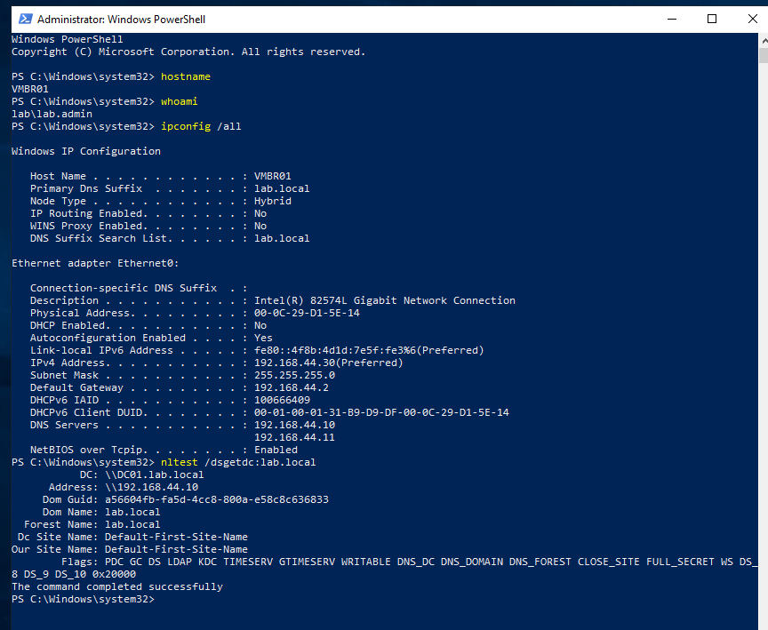

---

## Step 2 - Add a dedicated backup repository disk

A second virtual disk was added to `VBR01` and formatted as `D:` with the label `BACKUP_REPO`.

Disk layout:

```text
C: OS / Veeam installation
D: BACKUP_REPO / Veeam repository data
```

This separates the operating system from backup storage.

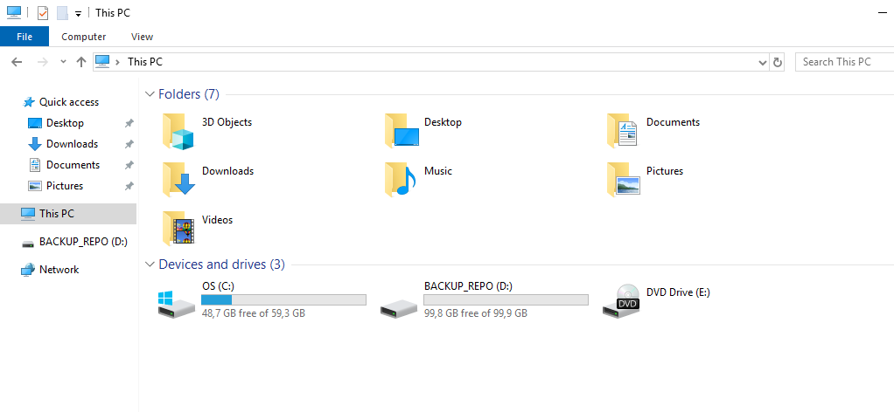

---

## Step 3 - Install Veeam Backup & Replication

Veeam Backup & Replication was installed on `VBR01`.

During installation, the local configuration database was configured using PostgreSQL.

The Veeam database stores configuration and metadata such as jobs, repositories, restore points, session history, and backup chain information. It does not store the backup data itself.

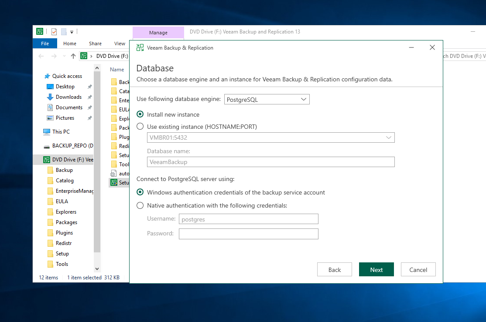

The Veeam application was installed on `C:`, while persistent and temporary backup-related data locations were placed on the dedicated `D:` disk.

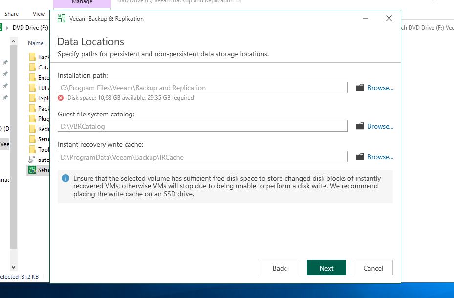

---

## Step 4 - Verify the default Veeam backup repository

After installation, Veeam created a default Windows backup repository on the dedicated backup disk.

Repository configuration:

```text
Repository: Default Backup Repository
Host:       VBR01.lab.local
Path:       D:\Backup
Capacity:   100 GB
```

The repository is where Veeam stores backup files such as full backups, incremental backups, and metadata files.

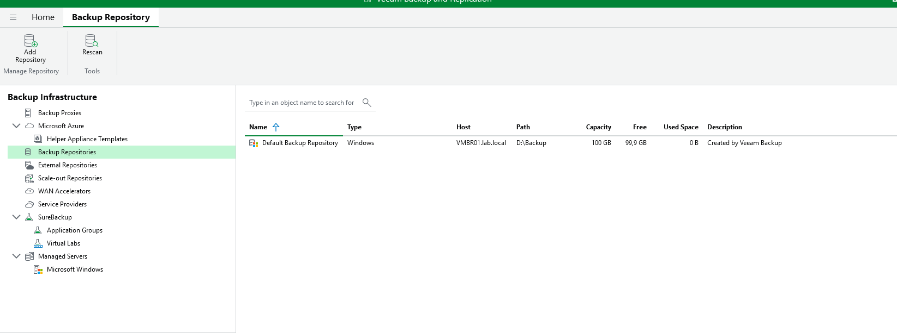

---

## Step 5 - Add FS01 as a managed Windows server

`FS01` was added to Veeam as a managed Microsoft Windows server.

This allows Veeam to communicate with `FS01`, deploy required components, and process backup/restore operations.

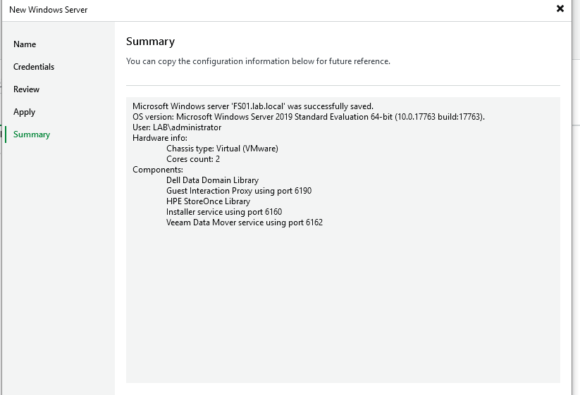

---

## Step 6 - Create and run the FS01 backup job

A Windows Agent backup job was created for `FS01`.

Job details:

```text
Job name:     FS01_File_Server_Backup
Type:         Windows Agent Backup
Protected OS: Windows Server 2019
Target:       Default Backup Repository
Schedule:     Manual for lab testing
```

The job completed successfully.

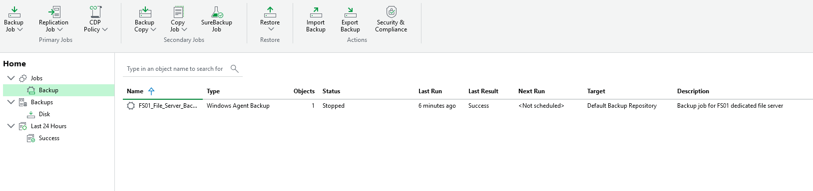

The backup repository now contains actual Veeam backup files for `FS01`.

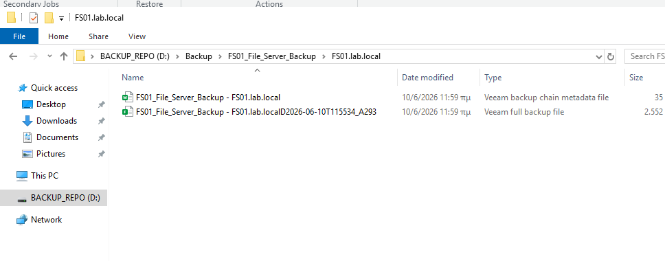

---

## Step 7 - Run an incremental backup after creating a test file

A restore test file was created on `FS01` under the IT share.

```text
FS01
D:\Shares\IT\restore-test.txt
```

After creating the file, the FS01 backup job was run again using a normal `Start`, not `Start active full`.

This created an incremental restore point.

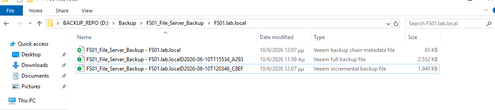

The backup chain now contains:

```text
Full backup        = baseline restore point
Incremental backup = changes after the full backup
Metadata file      = backup chain metadata
```

This demonstrates that after the initial full backup, normal job runs store only changed data as incremental backups.

---

## Step 8 - Simulate accidental file deletion

The test file was deleted from `FS01` to simulate a common user or administrator mistake.

```text
D:\Shares\IT\restore-test.txt deleted
```

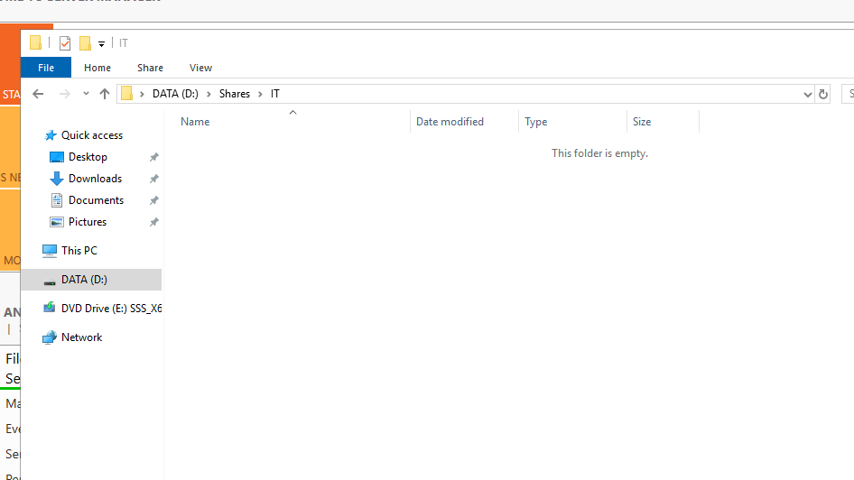

---

## Step 9 - Restore the deleted file from Veeam

A Guest Files Restore was started from the Veeam Agent backup.

The Veeam Backup Browser was used to browse the restore point and locate the deleted file inside the backup.

```text
FS01.lab.local
D:\Shares\IT\restore-test.txt
```

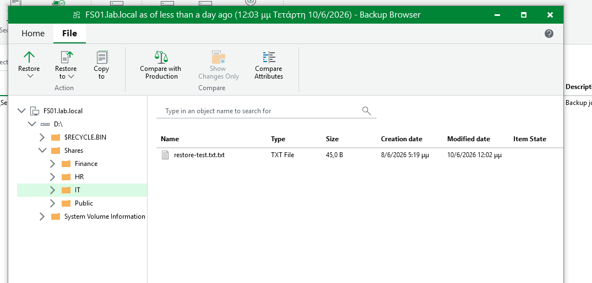

The file was restored back to its original location on `FS01`.

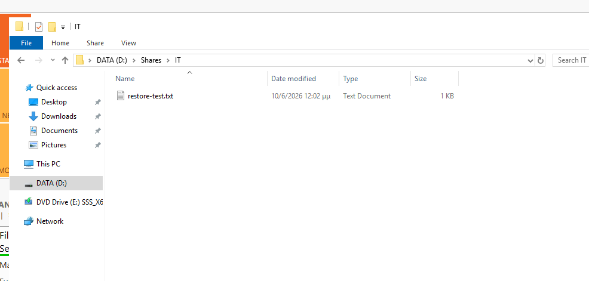

---

## Step 10 - Validate restore from CLIENT01

The final validation was performed from `CLIENT01` using an IT user account.

The restored file was visible through the mapped IT drive:

```text
IT Share (I:)
restore-test.txt
```

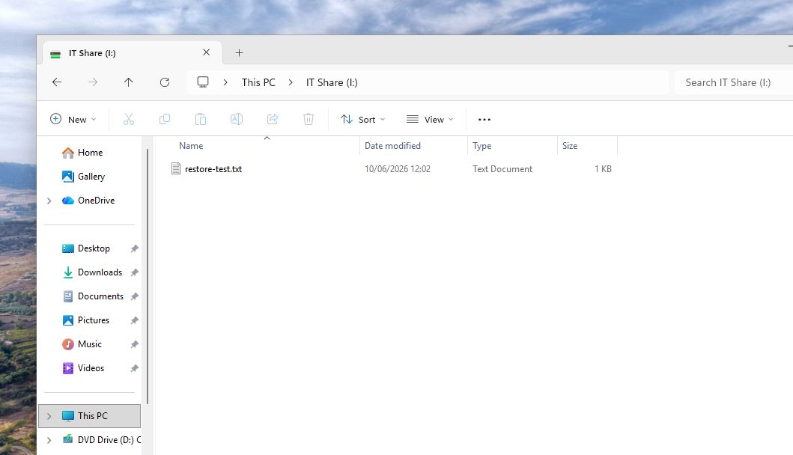

This confirms that the restore worked not only locally on the file server, but also from the user/client perspective through the SMB share.

---

## Step 11 - Add DC01 as a managed Windows server

`DC01` was also added to Veeam as a managed Windows server.

This allows Veeam to protect the Domain Controller as an infrastructure workload.

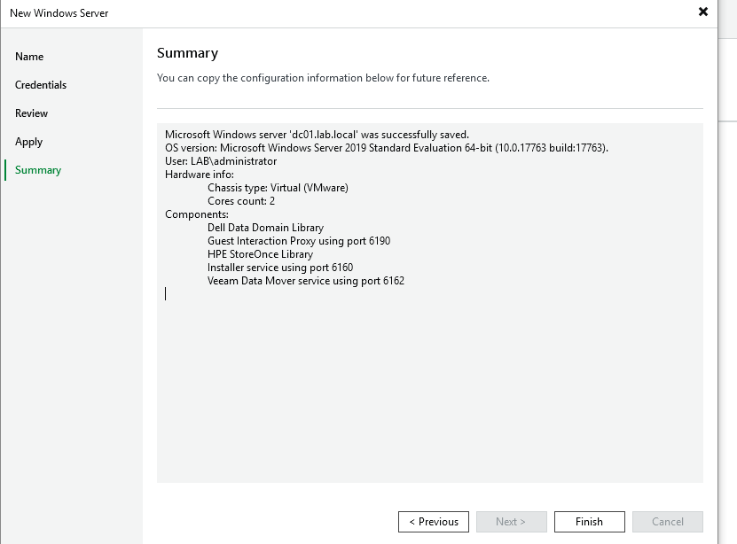

---

## Step 12 - Create an entire computer backup job for DC01

A separate Windows Agent backup job was created for `DC01`.

Backup mode:

```text
Entire computer
```

This is appropriate for a Domain Controller because it protects the server as a complete system, including system volumes and infrastructure components.

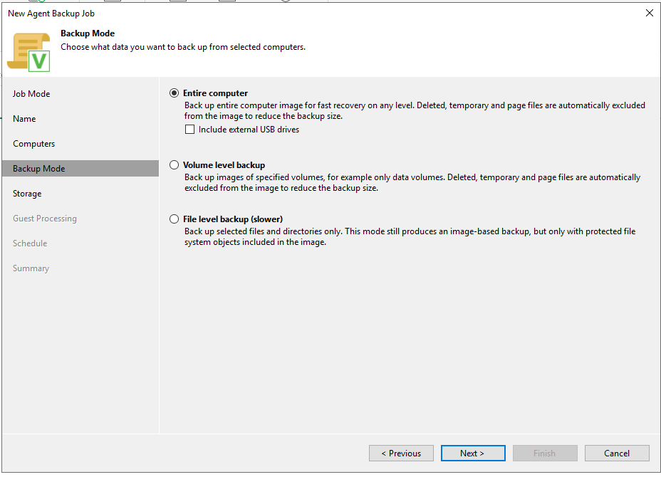

The backup target was the default Veeam repository on `VBR01`.

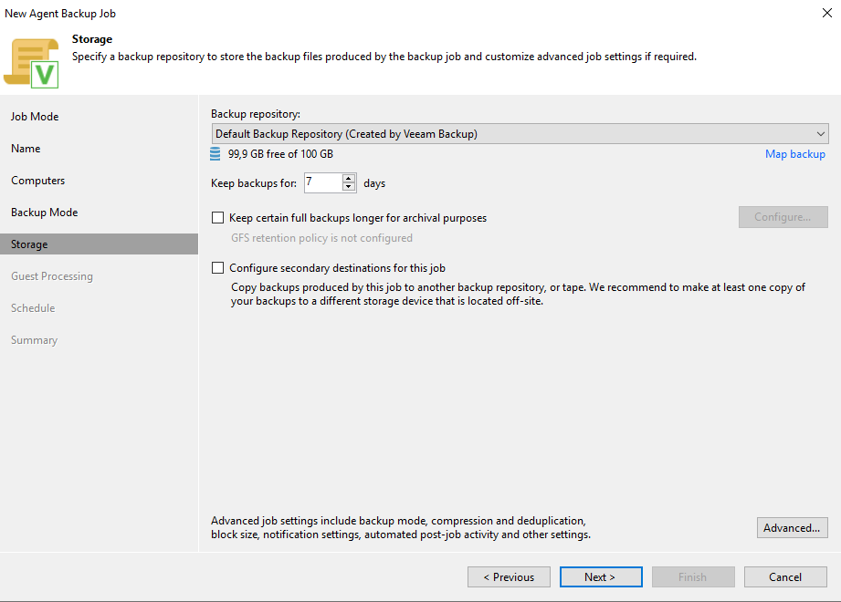

The DC01 backup job completed successfully.

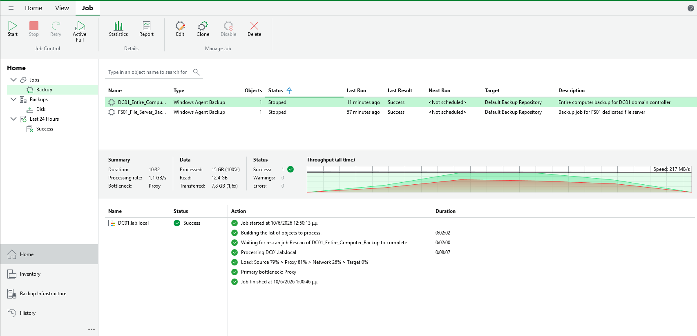

---

## Important note about Domain Controller restore

This lab performs a complete backup of `DC01`, but it does not perform a Domain Controller restore.

Domain Controller restore requires a separate controlled Active Directory disaster recovery procedure. Topics such as non-authoritative restore, authoritative restore, SYSVOL recovery, FSMO recovery, and replication consistency should be tested separately.

For this lab:

```text
FS01 = backup and restore validation performed
DC01 = entire computer backup performed, restore not performed
```

---

## What was learned

This lab covered:

- Installing Veeam Backup & Replication on a dedicated backup server.
- Separating the backup server role from domain and file server roles.
- Creating and validating a local backup repository.
- Adding Windows servers as managed Veeam servers.
- Creating a Windows Agent backup job for a file server.
- Understanding full and incremental backup files.
- Performing a guest file-level restore.
- Validating restored data from a domain client.
- Creating an entire computer backup for a Domain Controller.
- Understanding why Domain Controller restore needs a separate DR procedure.

## Final result

The lab successfully proves that the environment is not only backed up, but also recoverable at the file level.

```text
VBR01 backup server ready
FS01 file server backup successful
FS01 file-level restore successful
CLIENT01 validation successful
DC01 entire computer backup successful
```
