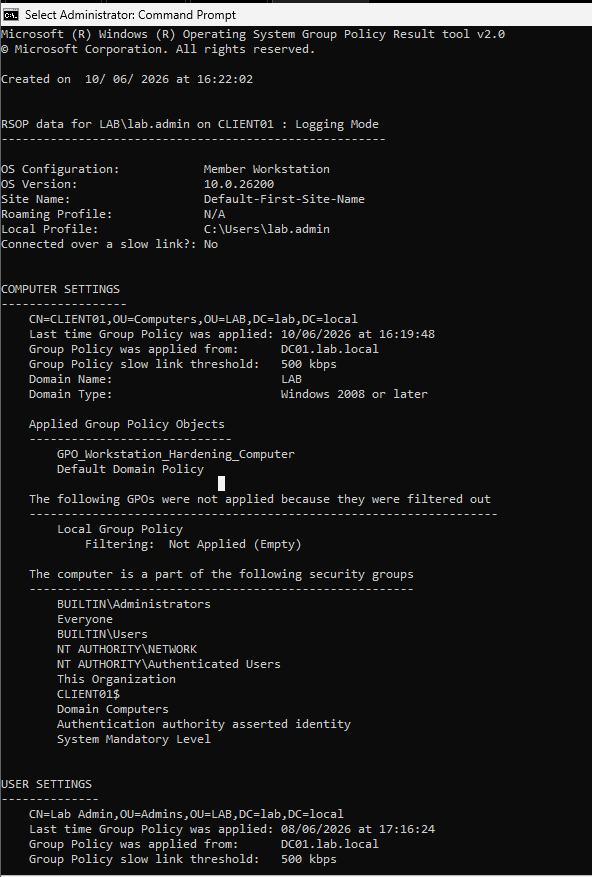
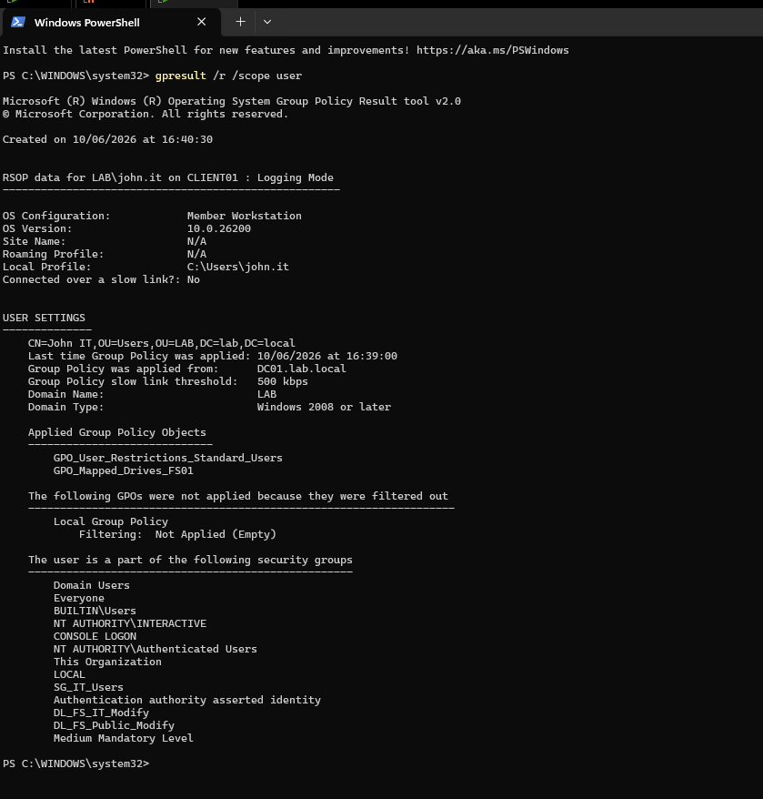
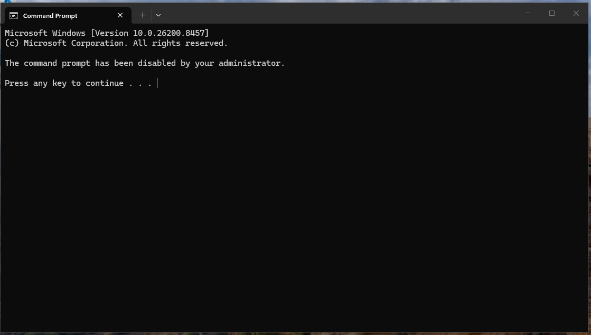
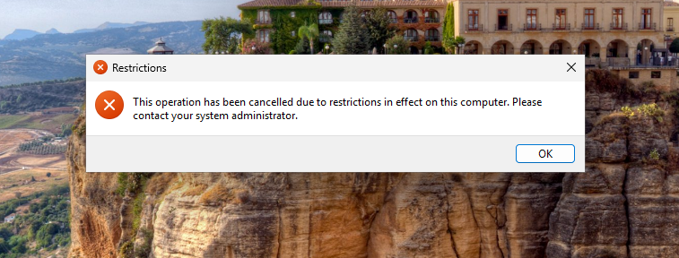
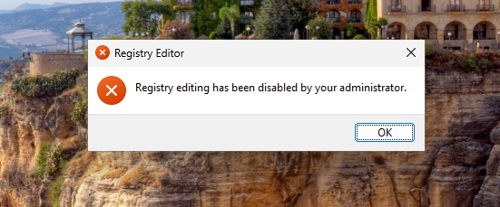
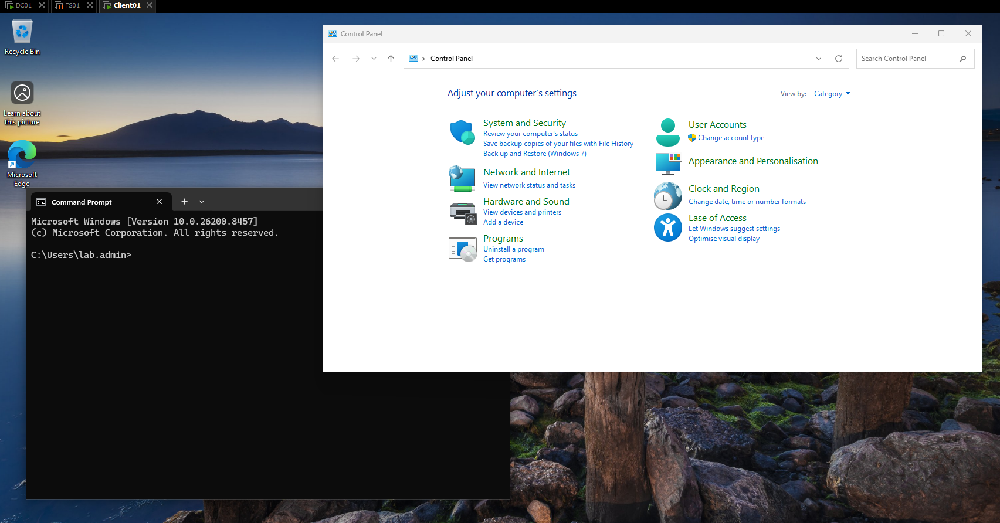
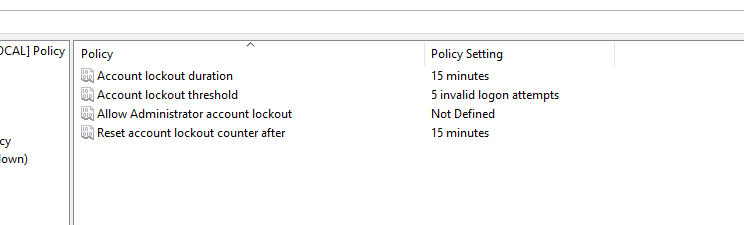
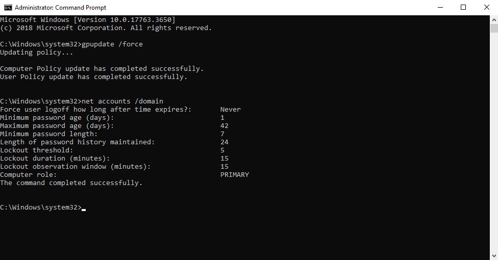
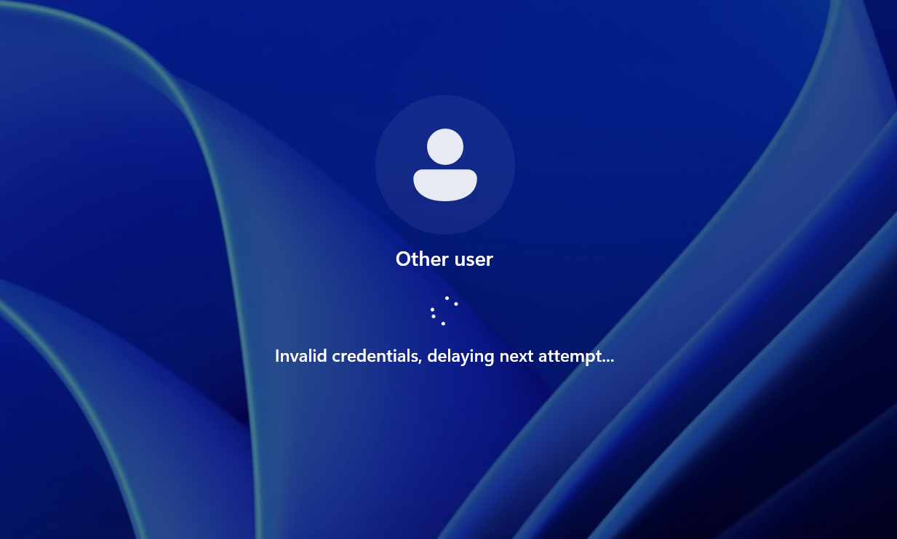
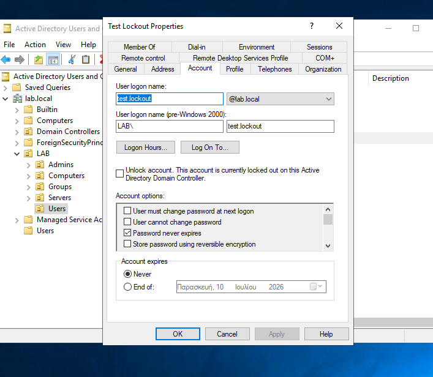

# Lab 07 - GPO Workstation Hardening and Account Lockout

## Objective

This lab focuses on Group Policy design and validation in a Windows Server Active Directory environment.

The goal was not only to configure hardening settings, but also to separate policies correctly based on scope:

- Computer hardening settings applied to workstation computer objects.
- User restrictions applied only to standard users.
- Domain account lockout settings applied at the domain level.

The lab was validated from both the client side and the domain controller side.

---

## Lab Environment

| Component | Role |
|---|---|
| DC01 | Primary Domain Controller, DNS, DHCP, Group Policy management |
| DC02 | Additional Domain Controller |
| CLIENT01 | Domain-joined Windows client used for validation |
| Domain | `lab.local` |
| Standard test user | `john.it` |
| Admin user | `lab.admin` |
| Lockout test user | `test.lockout` |

Relevant OU structure:

```text
LAB
├── Admins
├── Computers
├── Groups
├── Servers
└── Users
```

---

## GPO Design

Three policy areas were configured separately.

| GPO / Policy Area | Linked To | Purpose |
|---|---|---|
| `GPO_Workstation_Hardening_Computer` | `OU=Computers,OU=LAB` | Applies workstation security settings to CLIENT01 |
| `GPO_User_Restrictions_Standard_Users` | `OU=Users,OU=LAB` | Applies user restrictions to standard users like `john.it` |
| Default Domain Policy | Domain root | Applies domain account lockout policy |

This separation is important because not all GPO settings should be applied in the same place.

Computer policies follow the computer object. User policies follow the user object. Domain account policies are enforced by the domain controllers.

---

## Part 1 - Workstation Computer Hardening GPO

A new GPO was created and linked to the Computers OU:

```text
GPO_Workstation_Hardening_Computer
```

Path:

```text
Group Policy Management
-> lab.local
-> LAB
-> Computers
```

Configured settings:

```text
Computer Configuration
-> Policies
-> Windows Settings
-> Security Settings
-> Local Policies
-> Security Options
```

Settings configured:

| Policy | Setting | Reason |
|---|---:|---|
| Interactive logon: Machine inactivity limit | 900 seconds | Automatically locks inactive workstations after 15 minutes |
| Interactive logon: Do not display last signed-in user | Enabled | Prevents the login screen from revealing the last username |
| Accounts: Guest account status | Disabled | Ensures the built-in Guest account remains disabled |

### Validation

On CLIENT01, the computer-side GPO was validated with:

```cmd
gpresult /r /scope computer
```

The output shows that `GPO_Workstation_Hardening_Computer` was applied to CLIENT01.



---

## Part 2 - Standard User Restrictions GPO

A second GPO was created and linked to the Users OU:

```text
GPO_User_Restrictions_Standard_Users
```

Path:

```text
Group Policy Management
-> lab.local
-> LAB
-> Users
```

This GPO was used for user-side restrictions. These settings are intentionally not placed in the computer hardening GPO because they should affect standard users, not administrators.

Configured settings:

```text
User Configuration
-> Policies
-> Administrative Templates
```

| Policy Area | Policy | Setting |
|---|---|---|
| Control Panel | Prohibit access to Control Panel and PC settings | Enabled |
| System | Prevent access to registry editing tools | Enabled |
| System | Prevent access to the command prompt | Enabled |

For the Command Prompt policy, script processing was not disabled. This avoids unnecessarily breaking logon scripts or legacy administrative processes.

### User-side GPO validation

The standard user `john.it` was used to validate the restrictions.

The user-side GPO was confirmed using PowerShell:

```powershell
gpresult /r /scope user
```

The output shows that `GPO_User_Restrictions_Standard_Users` was applied to `john.it`.



### Command Prompt blocked

When `john.it` attempted to open Command Prompt, Windows displayed that Command Prompt had been disabled by the administrator.



### Control Panel blocked

When `john.it` attempted to open Control Panel / Settings, access was blocked due to restrictions in effect on the computer.



### Registry Editor blocked

When `john.it` attempted to open Registry Editor, Windows displayed that registry editing had been disabled by the administrator.



---

## Part 3 - Admin User Validation

A key part of this lab was confirming that the restrictions did not affect admin users.

The `lab.admin` account is located under the Admins OU, not the Users OU. Because the user restriction GPO is linked to the Users OU, `lab.admin` should not receive the standard user restrictions.

Validation was performed by logging into CLIENT01 as `lab.admin` and opening both Command Prompt and Control Panel successfully.



This confirms that the GPO targeting was correct and did not accidentally lock out administrative users from normal management tools.

---

## Part 4 - Domain Account Lockout Policy

The Account Lockout Policy was configured at the domain level using the Default Domain Policy.

This is important because account lockout settings for domain users are enforced by the domain controllers, not by a normal user-linked GPO.

Path:

```text
Default Domain Policy
-> Computer Configuration
-> Policies
-> Windows Settings
-> Security Settings
-> Account Policies
-> Account Lockout Policy
```

Configured settings:

| Policy | Setting |
|---|---:|
| Account lockout threshold | 5 invalid logon attempts |
| Account lockout duration | 15 minutes |
| Reset account lockout counter after | 15 minutes |



### Command-line validation

The domain account policy was validated on DC01 with:

```cmd
gpupdate /force
net accounts /domain
```

The output confirms:

```text
Lockout threshold: 5
Lockout duration (minutes): 15
Lockout observation window (minutes): 15
```



---

## Part 5 - Controlled Lockout Test

A dedicated test user was created for the lockout validation:

```text
test.lockout
```

The lockout test was performed from CLIENT01 by intentionally entering the wrong password multiple times.

During the repeated failed attempts, Windows showed an invalid credentials delay message.



After the threshold was reached, CLIENT01 showed that the referenced account was locked out and could not be logged on to.


The lockout was also confirmed from Active Directory Users and Computers on DC01. The Account tab showed that the account was currently locked out.



This validates the full lockout flow:

```text
Wrong password attempts on CLIENT01
-> Domain Controller enforces account lockout policy
-> Account becomes locked in Active Directory
-> Client login is denied
```

---

## What I Learned

- Computer Configuration settings apply to computer objects, not directly to users.
- User Configuration settings should be targeted carefully so they do not affect admin users by mistake.
- Account lockout policy is a domain-level security policy and should not be treated like a normal OU-level user restriction.
- `gpresult` is useful, but computer policy results require elevated/admin access.
- A policy is not fully proven until it is validated from the client side and, when relevant, from Active Directory.
- Blocking CMD does not automatically block PowerShell. Stronger application control would require additional technologies such as AppLocker or Windows Defender Application Control.

---

## Issues / Notes

- After blocking Command Prompt for `john.it`, validation commands had to be run from PowerShell instead.
- The first Windows login message after several wrong passwords showed an invalid credentials delay instead of immediately showing a lockout message.
- The account lockout was confirmed as authoritative from ADUC, and later CLIENT01 displayed the explicit locked-out message.
- Admin validation was performed to confirm that the standard user GPO did not accidentally affect `lab.admin`.

---

## Final Result

This lab successfully configured and validated:

- Workstation-level hardening for CLIENT01.
- Standard user restrictions for `john.it`.
- Admin exclusion from standard user restrictions.
- Domain-level account lockout policy.
- Controlled account lockout test using a dedicated test account.
