# Lab 08 - Windows LAPS Deployment and Local Administrator Password Management

## Objective

This lab focuses on deploying Windows LAPS in a Windows Server Active Directory
environment to centrally manage the local administrator password on
domain-joined workstations.

The goal was to replace the insecure practice of using a single shared local
administrator password across all machines with a solution that:

- Sets a unique, random password on each machine.
- Stores each password securely in Active Directory.
- Rotates passwords automatically on a schedule.
- Allows administrators to report on which machines have rotated and which have not.

The lab was validated from both the client side and the domain controller side,
and it documents the real troubleshooting required to get schema extension
working in a two-DC environment.

---

## Background - Why LAPS

Before LAPS, a common approach was to push the same local administrator password
to every workstation (for example, through Group Policy Preferences). This has a
serious weakness: if one machine is compromised and the password is recovered,
that single password grants local administrator access to every machine in the
domain. This is a primary enabler of lateral movement in ransomware incidents.

Two other approaches were tested earlier and rejected:

- **Group Policy Preferences (Local Users and Groups) password** - blocked by
  Microsoft since MS14-025. The password field is greyed out because the
  password was stored insecurely in SYSVOL.
- **Startup script that resets the password** - technically works but is fragile,
  stores a single shared password, and does not scale or report.

Windows LAPS solves all of these: unique password per machine, stored in AD,
rotated automatically, with built-in reporting.

---

## Lab Environment

| Component | Role |
|---|---|
| DC01 | Primary Domain Controller, DNS, Schema Master, LAPS management |
| DC02 | Additional Domain Controller |
| CLIENT01 | Domain-joined Windows client used for validation |
| Domain | `lab.local` |
| Managed local account | Built-in `Administrator` |
| Password backup directory | On-premises Active Directory |

Operating system: Windows Server 2019 (with the cumulative update that includes
the built-in Windows LAPS feature).

Relevant OU structure:

```text
LAB
├── Admins
├── Computers   <- CLIENT01 (LAPS policy linked here)
├── Groups
├── Servers
└── Users
```

---

## LAPS Deployment Overview

The deployment has four required parts, all performed on DC01:

| Step | Action | Purpose |
|---|---|---|
| 1 | Extend the AD schema | Adds the LAPS attributes to computer objects |
| 2 | Grant computer self-permission on the OU | Lets each machine write its own password to AD |
| 3 | Configure the LAPS GPO | Tells machines which account to manage, where to store the password, and password complexity |
| 4 | Validate | Confirm the password is written to AD and can be retrieved |

---

## Part 1 - Confirm Windows LAPS is Available

Windows LAPS is built into Windows Server 2019 only after the relevant cumulative
update is installed. Before the update, the LAPS cmdlets do not exist.

The presence of the feature was confirmed with:

```powershell
Get-Command Update-LapsADSchema
```

The cmdlet resolved with `Source: LAPS`, confirming the built-in Windows LAPS
module is present.

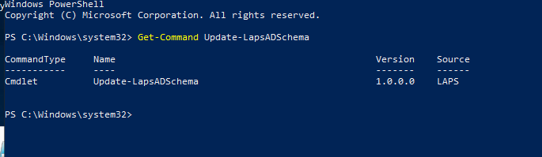

---

## Part 2 - Extend the AD Schema

The schema extension adds the LAPS attributes (such as `ms-LAPS-Password`,
`ms-LAPS-PasswordExpirationTime`, and the encrypted variants) to the directory.
It is a one-time, forest-wide operation and must run on the Schema Master.

```powershell
Update-LapsADSchema
```

This step required significant troubleshooting. See
[Part 6 - Issues and Troubleshooting](#part-6---issues-and-troubleshooting)
for the full story. Once the underlying problems were resolved, the schema
extension completed successfully, adding each attribute in turn.

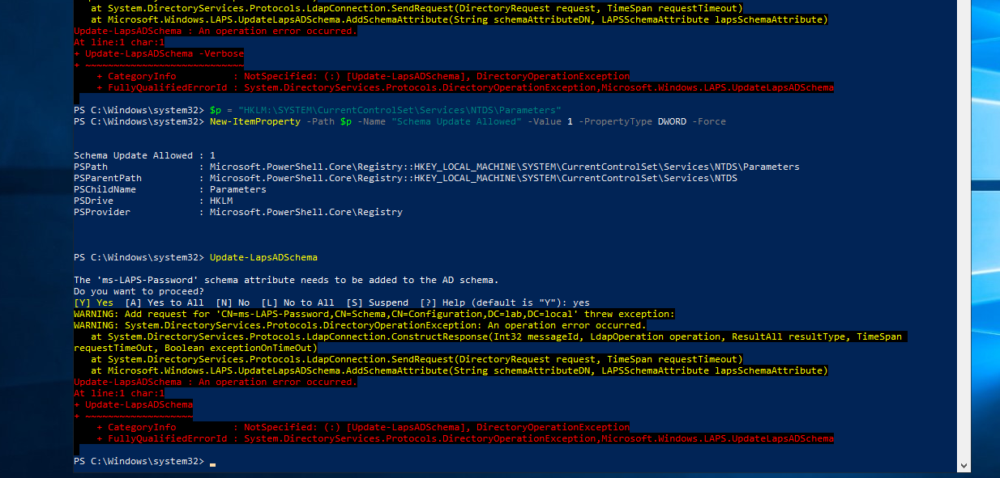

---

## Part 3 - Grant Computer Self-Permission

Each computer object needs permission to write its own LAPS password attribute.
This permission is granted at the OU level, on the OU that contains the machines.

```powershell
Set-LapsADComputerSelfPermission -Identity "OU=Computers,OU=LAB,DC=lab,DC=local"
```

This grants machines in `LAB/Computers` the `SELF` right to update their LAPS
password attributes. Without this, machines apply the policy but cannot store the
password.

---

## Part 4 - Configure the LAPS GPO

A GPO named `LAPS-Policy` was created and linked to `OU=Computers,OU=LAB`.

Path:

```text
Computer Configuration
-> Policies
-> Administrative Templates
-> System
-> LAPS
```

Settings configured:

| Policy | Setting | Reason |
|---|---|---|
| Configure password backup directory | Active Directory | Store the password in on-premises AD (not Azure AD) |
| Name of administrator account to manage | Administrator | Manage the built-in local administrator |
| Password Settings | 14 chars, full complexity, 30-day age | Defines password strength and rotation interval |

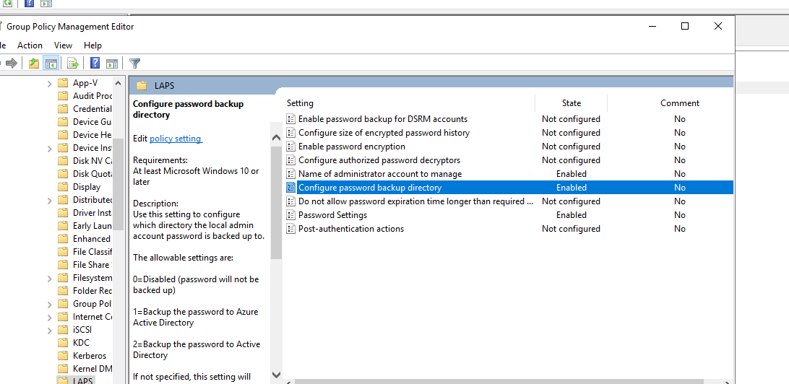

### Note on the managed account

This lab manages the **built-in** `Administrator`. The built-in account already
exists on every Windows installation, so no account creation is required - it
only needs to be enabled (it is disabled by default). LAPS manages the password
but does not create or enable the account on this Server 2019 build.

Enabling the account automatically at scale is deliberately **not** done via GPP.
Group Policy Preferences (Local Users and Groups) cannot set a password for the
account (the field is blocked by MS14-025), so an `Update` action fails with
`0x800708c5` (password does not meet policy) because it attempts to apply a blank
password. Startup scripts were also tested earlier and proved fragile.

The chosen approach is therefore the standard production one: **enable the
built-in Administrator once in the golden image** (`net user Administrator
/active:yes`). Every machine deployed from that image arrives with the account
enabled, and LAPS takes over the password from the first policy cycle. For the
existing lab clients, the account was enabled manually to demonstrate the flow.

A future alternative is a dedicated custom local admin account combined with the
newer Windows LAPS "automatic account management" setting (which creates and
enables the account itself), but that setting is not present in this build of
Server 2019.

---

## Part 5 - Validation

Validation was performed against a freshly built client (CLIENT02) joined to the
domain and moved into `LAB/Computers`, in addition to the existing CLIENT01.

On the client, the built-in Administrator was enabled and policy applied:

```powershell
net user Administrator /active:yes
gpupdate /force
```

After a reboot, LAPS performed its first rotation automatically (no manual
trigger needed - it runs on the policy cycle) and wrote the password to the
computer object in AD.

### Retrieval from Active Directory (GUI)

The password can be read from the **LAPS** tab on the computer object in Active
Directory Users and Computers. It shows the managed account name, the current
password, and the expiration date:

```text
LAPS local admin account name:     Administrator
LAPS local admin account password: (unique per machine)
Current LAPS password expiration:  1 August 2026
```

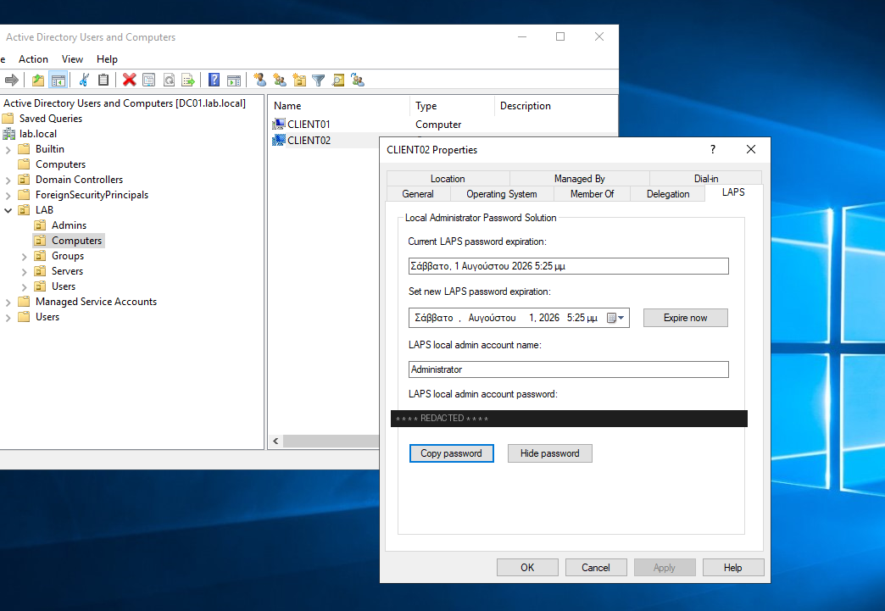

### Retrieval from Active Directory (PowerShell)

The same result via PowerShell, shown for both machines:

```powershell
Get-LapsADPassword -Identity CLIENT02 -AsPlainText
```

Each machine has a **different, random password**, stored encrypted, with a
successful decryption authorized to `LAB\Domain Admins`:

```text
ComputerName        : CLIENT01
Account             : Administrator
Password            : (unique random value)
Source              : EncryptedPassword
DecryptionStatus    : Success
AuthorizedDecryptor : LAB\Domain Admins

ComputerName        : CLIENT02
Account             : Administrator
Password            : (different unique random value)
Source              : EncryptedPassword
DecryptionStatus    : Success
AuthorizedDecryptor : LAB\Domain Admins
```

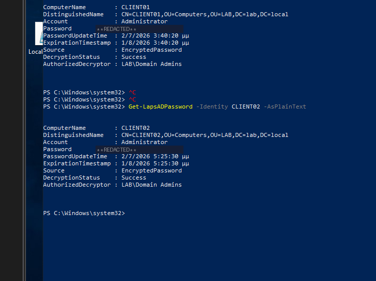

This is the core proof of the lab: two machines, two unique passwords, encrypted
in AD, retrievable only by an authorized decryptor.

### Reporting across the domain

One of the main advantages of LAPS is the ability to report on which machines
have rotated their password and which have not:

```powershell
Get-ADComputer -Filter * -Properties msLAPS-PasswordExpirationTime |
  Select Name, @{N="Expires";E={[datetime]::FromFileTime($_."msLAPS-PasswordExpirationTime")}}
```

Machines with a recent expiration value have working LAPS. Machines with an empty
or old value have not received the change (for example, remote machines that have
not connected, or machines where policy processing failed). In production this
becomes a weekly coverage check.

---

## Part 6 - Issues and Troubleshooting

The schema extension did not work on the first attempt. The troubleshooting
process is documented here because the diagnostic path is more valuable than the
final command.

### Issue 1 - Insufficient access rights

The first run of `Update-LapsADSchema` failed with "The user has insufficient
access rights." Schema modification requires membership in the **Schema Admins**
group.

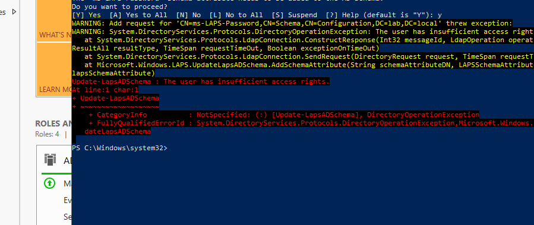

The account was added to Schema Admins. Group membership does not take effect in
the current session - a full logoff/reboot is required for the new token.

### Issue 2 - Operation error occurred

After fixing permissions, the run failed with a generic "An operation error
occurred" on the very first attribute.

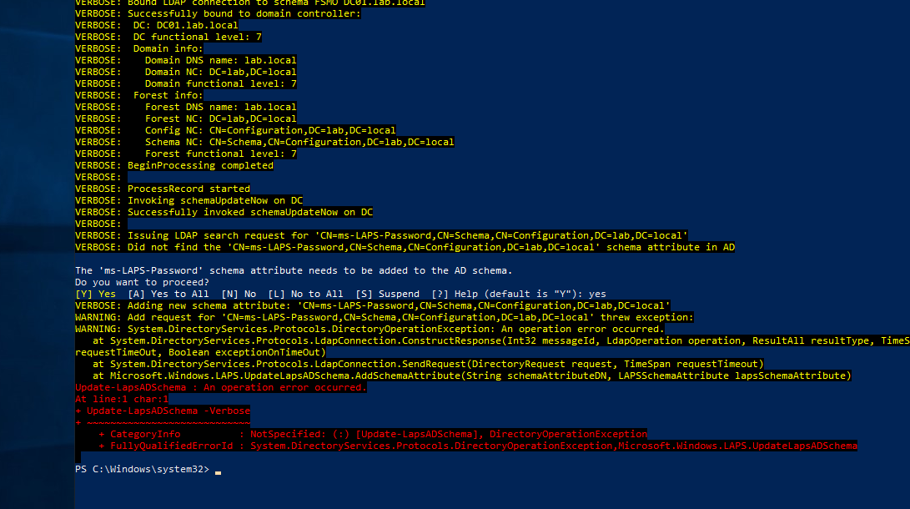

The `Directory Service` event log revealed the real cause via Event 2092: DC01
owned the Schema Master FSMO role but did not consider it valid, because it had
not replicated successfully with its partner (DC02) since restart. While the role
is invalid, all schema modifications are blocked.

The root cause was found in Event 2087: DC01 could not resolve the `_msdcs`
record of DC02 (DNS lookup failure). DC02 had been powered off earlier, which
broke replication of the Schema and Configuration partitions.

### Issue 3 - DNS / replication failure

`repadmin /showrepl` confirmed that the `DC=lab` partition replicated fine, but
`CN=Schema` and `CN=Configuration` were failing with error 8524 (DNS lookup
failure). DC02 was powered back on. DC01's IPv4 DNS configuration was verified
(preferred DNS pointing to itself, alternate to DC02):

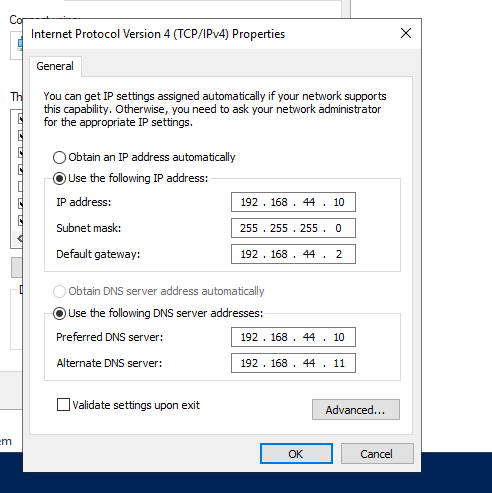

Replication was then forced explicitly for the affected partitions:

```powershell
repadmin /replicate DC01 DC02 "CN=Schema,CN=Configuration,DC=lab,DC=local"
repadmin /replicate DC01 DC02 "CN=Configuration,DC=lab,DC=local"
```

Both reported "completed successfully." With the Schema partition synchronized,
the FSMO role became valid, and `Update-LapsADSchema` completed successfully.

### Issue 4 - Custom account creation blocked

An attempt to use a dedicated `LocalAdmin` account via GPP failed with
`0x800708c5` (password does not meet policy) because the account was created with
a blank password, and `0x80070534` (no mapping between account names and SIDs)
when trying to add the non-existent account to the Administrators group. This
confirmed that LAPS does not create accounts on this build, and the lab switched
to the built-in Administrator.

---

## Part 7 - Password Rotation and Recovery Operations

Deploying LAPS is only half the job; day-to-day operations require knowing how to
force a rotation and how to recover access when something goes wrong. This part
documents those procedures.

### How rotation actually works (pull, not push)

A key point that is easy to misunderstand: expiring a password in AD does **not**
push a change to the machine. The model is pull-based. Each machine runs a LAPS
background task roughly every hour that reads the stored expiration time, and if
it has passed, the machine generates a new password and writes it to AD. So
"Expire now" in AD only marks the password as expired - the actual rotation
happens on the machine's next cycle (or reboot, or a manual trigger).

### Forcing a rotation

There are three supported ways to rotate early, differing by where they run:

| Method | Where it runs | Effect |
|---|---|---|
| `Set-LapsADPasswordExpirationTime -Identity <PC>` | DC (remote) | Marks the password expired; machine rotates on its next cycle |
| "Expire now" button on the ADUC LAPS tab | DC (remote, GUI) | Same as above, via GUI |
| `Reset-LapsPassword` | On the machine itself (local) | Immediate rotation, regardless of expiration |

To avoid waiting for the hourly cycle after expiring from the DC, run
`Invoke-LapsPolicyProcessing` on the machine to process the policy immediately.

Note: `Reset-LapsPassword` does **not** take an `-Identity` parameter - it only
rotates the local machine's own password. To target a remote machine from the DC,
use `Set-LapsADPasswordExpirationTime` instead.

### Rotation validated (before / after)

The rotation flow was validated end to end.

Before - current password and update time:

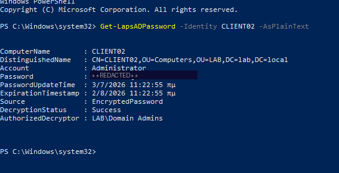

Expiration forced from the DC (`Status: PasswordReset`):

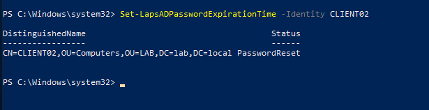

Policy processing forced on the client:


After - a **new** password and a new update timestamp, confirming the rotation:

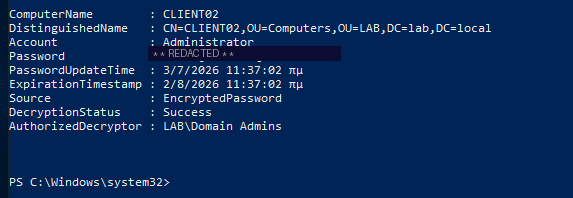

### Recovery: getting into a machine when the current password fails

The scenario: you are in front of a machine, need local administrator access, but
the LAPS password shown in AD does not work (for example the machine rotated
while offline and never synced back).

First line of recovery is the **password history**. LAPS keeps previous passwords,
so one of them likely matches what the machine has locally:

```powershell
Get-LapsADPassword -Identity CLIENT02 -AsPlainText -IncludeHistory
```

You do not need a command prompt on the client to do this - you read the password
from the DC (or your own machine) first, then type it at the client's login screen
as `.\Administrator`.

If no stored password works at all (the machine has a password AD never received),
LAPS cannot help and you fall back to an **offline reset via boot media** (boot
the Windows ISO, open a command prompt, reset the local Administrator) - the same
technique used for DC recovery. This is the last resort.

### Operational notes surfaced by the LAPS event log

The LAPS event log (`Microsoft-Windows-LAPS/Operational`) surfaced two useful
items during testing:

- **Event 10067** - "The configured local account is currently disabled." This
  confirmed that the managed account must be enabled before LAPS can manage it.
- **Event 10108** - the `msLAPS-CurrentPasswordVersion` attribute is missing from
  the schema. This attribute supports rollback (torn-state) detection. All primary
  scenarios work without it, but re-running the latest `Update-LapsADSchema`
  (from a newer build) is recommended to add it.

Also visible: **Event 10041** shows LAPS scheduling a post-authentication rotation
after the managed account was used to log in, based on the configured
24-hour grace period (`Post authentication actions: 0x3`).

---

## What I Learned

- LAPS manages the **password** of an existing account - it does not create or
  enable the account (on this Server 2019 build).
- Rotation is **pull-based**: expiring a password in AD does not push to the
  machine; the machine rotates on its next hourly cycle, reboot, or when forced
  with `Invoke-LapsPolicyProcessing`.
- `Reset-LapsPassword` is local-only (no `-Identity`); remote rotation is done
  from the DC with `Set-LapsADPasswordExpirationTime`.
- Password **history** (`-IncludeHistory`) is the first recovery tool when the
  current password does not match the machine; offline media reset is the last
  resort.
- The GPP password field is blocked by MS14-025; you cannot set a password there.
  This blocks the "custom account with initial password" approach on older LAPS
  builds.
- Schema modifications require Schema Admins membership **and** a valid Schema
  Master FSMO role.
- A powered-off second DC can silently break schema changes: broken replication
  invalidates the FSMO role, which blocks schema writes.
- Replication problems often trace back to DNS. `repadmin /showrepl` and the
  `Directory Service` event log are the right diagnostic tools.
- The password backup directory setting must match the machine's **join type**
  (Active Directory for on-prem/hybrid joined, Azure AD for Entra-only).

---

## Final Result

This lab successfully configured and validated:

- Windows LAPS schema extension in a two-DC forest.
- Computer self-permission on the workstation OU.
- A LAPS GPO managing the built-in Administrator, storing the password in AD.
- Automatic enable of the built-in Administrator via GPP.
- End-to-end password rotation and retrieval from Active Directory.
- A reporting query for domain-wide rotation coverage.
